# 2017 Google Summer of Code Grand Wrap-Up Post

by the Processing Foundation

This summer was the Processing Foundation’s sixth year participating in [Google Summer of Code](https://web.archive.org/web/20251011135613/https://summerofcode.withgoogle.com/). As always, it was as productive as it was fun meeting new students and expanding our community. We received an impressive 90 applications, a significant increase from previous years, and were able to offer 16 positions.

The Processing Foundation supports the development of three open source software projects — [Processing](https://web.archive.org/web/20251011135613/https://processing.org/), [p5.js](https://web.archive.org/web/20251011135613/https://p5js.org/), and [Processing.py](https://web.archive.org/web/20251011135613/https://py.processing.org/) — and we were lucky this year to have students contributing extensively to both Processing and p5.js, as well as helping us reach a milestone in officially releasing [Processing for Android](https://web.archive.org/web/20251011135613/http://android.processing.org/), which has been in the works since 2009.

Our mentors included longtime contributors to our software, members of our Board, and current fellows and fellowship alumni. Their expertise was essential to GSoC being a success and deepening the connections and sharing of knowledge which is so important to making open source sustainable. The mentors were [Tega Brain](https://web.archive.org/web/20251011135613/http://tegabrain.com/), [Andres Colubri](https://web.archive.org/web/20251011135613/http://andrescolubri.net/), [Jeremy Douglass](https://web.archive.org/web/20251011135613/https://github.com/jeremydouglass), [Ben Fry](https://web.archive.org/web/20251011135613/https://fathom.info/), [Gottfried Haider](https://web.archive.org/web/20251011135613/http://ghai.xyz/), [Claire Kearney-Volpe](https://web.archive.org/web/20251011135613/http://www.takinglifeseriously.com/index.html), [Golan Levin](https://web.archive.org/web/20251011135613/http://www.flong.com/), [Lauren McCarthy](https://web.archive.org/web/20251011135613/http://lauren-mccarthy.com/), [Manindra Moharana](https://web.archive.org/web/20251011135613/http://www.mkmoharana.com/), [Luisa Pereira](https://web.archive.org/web/20251011135613/http://luisaph.com/index1.html), [Casey Reas](https://web.archive.org/web/20251011135613/http://reas.com/), [Daniel Shiffman](https://web.archive.org/web/20251011135613/http://shiffman.net/), [Jason Sigal](https://web.archive.org/web/20251011135613/http://www.jasonsigal.cc/), [Cassie Tarakajian](https://web.archive.org/web/20251011135613/https://github.com/catarak), [Lee Tusman](https://web.archive.org/web/20251011135613/http://leetusman.com/), and [David Wicks](https://web.archive.org/web/20251011135613/https://sansumbrella.com/).

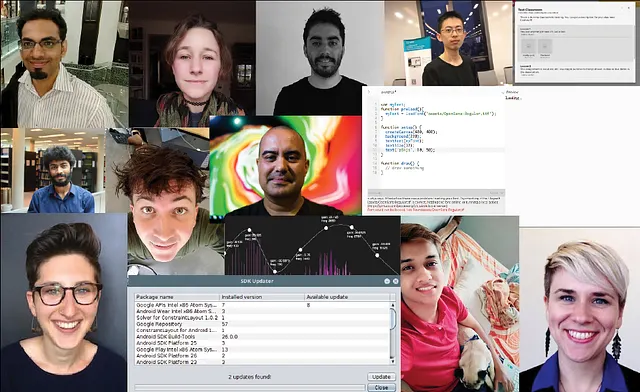

*Our 2017 Google Summer of Code students!*

## Processing

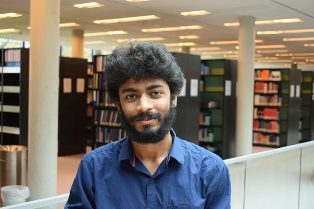

*Abhik Pal*

[Abhik Pal](https://web.archive.org/web/20251011135613/https://abhikpal.github.io/)

 worked on p5py, a native Python package based on the core ideas and API of Processing, which included a system that could work with Processing-style sketches, support for for basic 2D drawing, a color parsing system similar to Processing’s, and utility functions to perform basic mathematical operations. In Pal’s own words: “The main motivation behind creating p5 was to leverage Python’s readability and Processing’s emphasis on coding in a visual context to make programming easier to teach.” Read more [here](https://web.archive.org/web/20251011135613/https://abhikpal.github.io/blog/2017/08/27/p5-google-summer-of-code-progress-report).

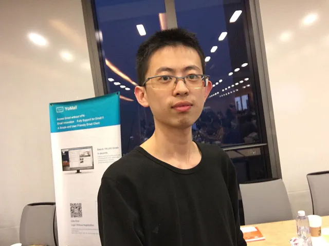

*Ce Gao*

[Ce Gao](https://web.archive.org/web/20251011135613/https://github.com/gaocegege)

 worked on creating an experimental new mode in Processing for R Language, which allows users to write Processing sketches using the R language. The mode can be installed in the Processing Development Environment (PDE). It can also run on the command line as a stand-alone jar. Processing.R supports importing standard Processing(Java) libraries that enrich the functionality of Processing. Processing.R is still in early development, but you can try the experimental mode and provide [feedback](https://web.archive.org/web/20251011135613/https://github.com/gaocegege/Processing.R/issues). Read more [here](https://web.archive.org/web/20251011135613/https://github.com/gaocegege/Processing.R).

## Processing for Android

*Sara Di Bartolomeo*

[Sara Di Bartolomeo](https://web.archive.org/web/20251011135613/https://picorana.github.io/projects)

 built “VR Audioscape,” a virtual reality application made to demonstrate and document the possibilities of the new Processing Android Cardboard Mode.

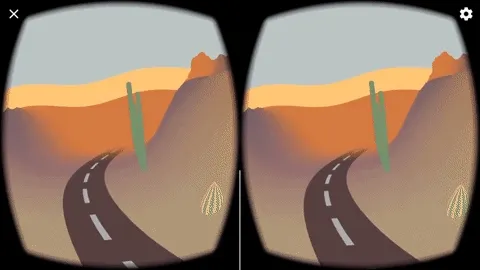

*VR Audioscape*

In Sara’s words: “It lets you travel through a procedural landscape generated according to music. Play any music from any app on your phone, then run the app: it will automatically use as input any sound coming as output from the phone.” Read more [here](https://web.archive.org/web/20251011135613/https://github.com/picorana/VR_audioscape).

*Sarjak Thakkar*

[Sarjak Thakkar](https://web.archive.org/web/20251011135613/https://github.com/tsarjak)

 worked on an Image Processing Library to ease differentiation of colors for people with colorblindness. The project included research on various image-processing algorithms that increase the contrast in areas of images to differentiate between objects and colors in an image. Different levels and kinds of contrast were tested and surveyed. The code for all the proposed algorithms was implemented by the end of the project. Read more [here](https://web.archive.org/web/20251011135613/https://gsocsarjak.wordpress.com/finalsubmission/) and [here](/web/20251011135613/https://medium.com/@ProcessingOrg/image-processing-library-to-ease-differentiation-of-colors-for-people-with-colorblindness-cc550f0670e0).

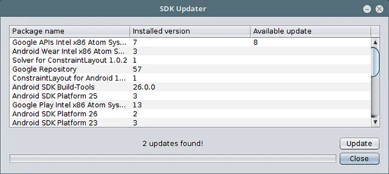

*Rupak Das*

[Rupak Das](https://web.archive.org/web/20251011135613/https://github.com/rupak0577/)

 transitioned the Processing for Android build process from using ANT scripts to Gradle, a newer build tool that will be more compatible with the current Android SDK. The ant scripts and tool dependencies were removed, the build system was changed to Gradle, a new GUI for updating the Android SDK from within Processing Android was created, and support for creating/managing AVDs using the newer avdmanager was added. All the specified goals of the project were achieved within the time frame of GSOC. Read more [here](https://web.archive.org/web/20251011135613/https://procandsoc17.wordpress.com/2017/08/25/final-report/).

## p5.js

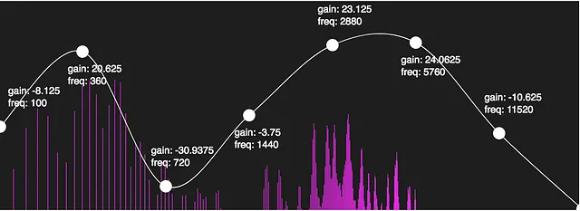

*Jeevan Farias*

[Jeevan Farias](https://web.archive.org/web/20251011135613/http://jvn.tf/)

 furthered development of the p5.Sound library, including new effects, presets, and modules for algorithmic composition. In Jeevan’s own words: “These developments will be useful and interesting to electronic musicians interested in visual art, visual artists interested in electronic music, sound artists, and any other potential user of Processing.” Read more [here](https://web.archive.org/web/20251011135613/https://jvntf.github.io/gsoc_workproduct/).

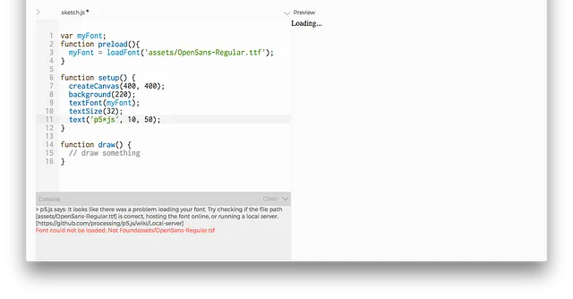

*Alice Chung’s friendly error system.*

[Alice Chung](https://web.archive.org/web/20251011135613/https://almchng.itch.io/)

 expanded the p5.js Friendly Debugger, which was originally begun at the p5.js Contributor’s Conference, and further developed by Processing Foundation Fellows Jess Klein and Atul Varma. The Friendly Debugger checks function calls for correct parameter input, identifies common JavaScript and p5.js errors, and provides feedback in a friendly and inclusive way. Read more [here](/web/20251011135613/https://medium.com/@almchung/gsoc17-redesign-friendly-debugger-for-p5-js-cf63a85ae57).

*Kate Hollenbach*

*Stalgia Grigg*

[Kate Hollenbach](https://web.archive.org/web/20251011135613/http://www.katehollenbach.com/)

 and [Stalgia Grigg](https://web.archive.org/web/20251011135613/http://stalgiagrigg.name/) worked together to overhaul the 3D rendering WebGL mode to remove bugs, improve performance, and extend functionality. The p5.Shader object was developed, to provide access to the uniforms and attributes of a GL program; it compiles and links the program, and provides an API to set up the shader program for rendering. Read more from Kate [here](https://web.archive.org/web/20251011135613/http://www.katehollenbach.com/gsoc-2017/) and Stalgia [here](https://web.archive.org/web/20251011135613/https://mlarghydracept.github.io/GSOC17/).

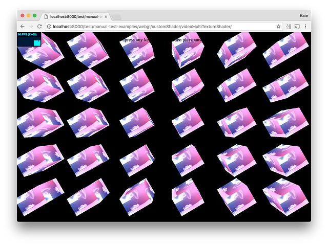

*The screenshot above shows a custom shader rendering the surfaces of a grid of cubes. The shader blends an image and video using two different texture samplers in GLSL and tints the color according to mouseX and mouseY via custom uniforms.*

*Cristóbal Valenzuela*

[Cristóbal Valenzuela](https://web.archive.org/web/20251011135613/http://cvalenzuelab.com/)

 built “Mappa,” a set of p5.js tools around mapping. In his own words: “Mappa is a library to facilitate work between the <canvas> element and existing map libraries and APIs. It provides a set of tools for working with static maps, interactive tile maps and geo-data among other tools useful when building geolocation-based visual representations. Mappa was originally designed for p5.js, but it can be used with plain javascript or with other libraries that use the canvas element as the render object.” Read more [here](https://web.archive.org/web/20251011135613/https://github.com/cvalenzuela/Mappa) and [here](/web/20251011135613/https://medium.com/@ProcessingOrg/maps-maps-maps-f0914218c87b).

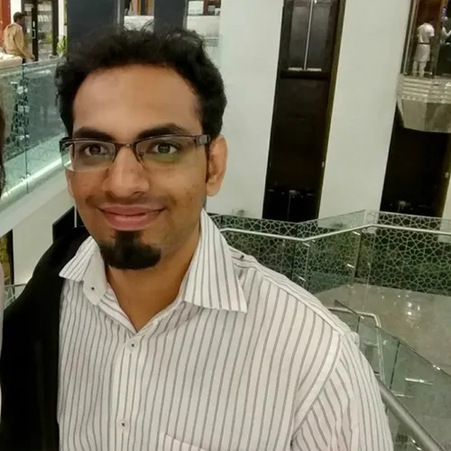

*Saksham Saxena*

[Saksham Saxena](https://web.archive.org/web/20251011135613/https://github.com/sakshamsaxena)

 worked on improving infrastructural aspects and operations of the p5.js library, independent of the library API itself. The outcome of the project was improved developer operations (via Issue Templates and Release Process Automation), and improved library accessibility (via the Modularisation Task), which are implemented as alpha. New features were implemented in p5.js for the next release. Read more [here](https://web.archive.org/web/20251011135613/https://github.com/processing/p5.js/wiki/Wrapping-Up-GSoC-2017-(by-@sakshamsaxena)).

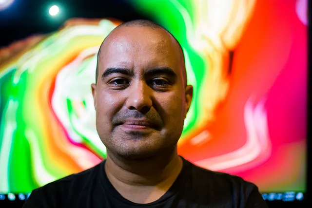

*Aarón Montoya-Moraga*

[Aarón Montoya-Moraga](https://web.archive.org/web/20251011135613/http://montoyamoraga.io/)

 continued his Spanish translation and community outreach work. He worked on development of the website and internationalization infrastructure in order to translate p5.js and Processing reference materials. Read more [here](https://web.archive.org/web/20251011135613/https://github.com/montoyamoraga/gsoc_2017).

## p5.js Web Editor

*Jen Kagan*

[Jen Kagan](https://web.archive.org/web/20251011135613/https://kaganjd.github.io/portfolio/)

 worked on improving the debugging and development experience in the p5 web editor by implementing autocomplete code suggestions, and improving the existing console. Read more [here](https://web.archive.org/web/20251011135613/http://blog.jennnkagan.com/2017/08/19/google-summer-of-code-final-submission/).

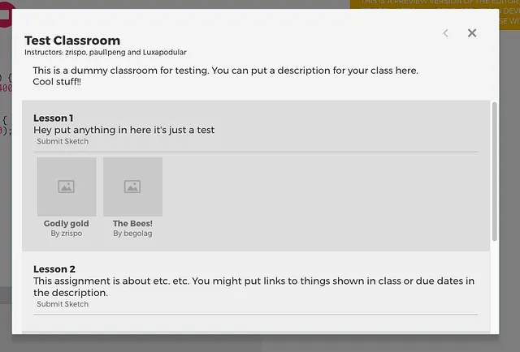

*An early version of the classrooms system.*

[Zach Rispoli](https://web.archive.org/web/20251011135613/http://zrispo.co/)

 worked on a free-to-use classrooms system for p5.js, creating a system for instructors that are using p5.js to teach classes. In Zach’s own words: “This system is built-in to the p5.js Web Editor and makes it easy to: keep track of all the projects students are creating; organize all assignments, links, and other resources in once place that all students can access; and create a gallery page with a permanent URL where selected classwork can be viewed publicly.” Read more [here](/web/20251011135613/https://medium.com/@zrispo/a-free-to-use-classrooms-system-for-p5-js-5d7b455ded08).

We’d like to thank the entire Google Summer of Code crew for all their hard work!

---

*Originally published on [Medium](https://medium.com/@ProcessingOrg/2017-google-summer-of-code-grand-wrap-up-post-16680b1438db). Archived 2026-03-09.*
