# 2018 Google Summer of Code Grand Wrap-Up Post

This summer was the Processing Foundation’s seventh year participating in Google Summer of Code. As always, it was as productive as it was fun meeting new students and expanding our community. We received an impressive 112 applications, a significant increase from previous years, and were able to offer 16 positions.

For the past few weeks, we’ve been posting long-form articles written by selected students, detailing their work. This article includes summaries of all the projects, with relevant links. The projects this year covered a wide range, from a total overhaul of the Processing Sound library, to help with the public release of the p5.js web editor, to the development of an app to help teachers and students collaborate on STEM education.

Our mentors included longtime contributors to our software, members of our Board, and current fellows and fellowship alumni. Their expertise was essential to GSoC being a success and deepening the connections and sharing of knowledge which is so important to making open source sustainable. The mentors were Alice Chung, [Andres Colubri](https://web.archive.org/web/20251011135633/http://andrescolubri.net/), [Casey Reas](https://web.archive.org/web/20251011135633/https://users.dma.ucla.edu/~reas/), [Cassie Tarakajian](https://web.archive.org/web/20251011135633/https://cassietarakajian.com/), [Daniel Shiffman](https://web.archive.org/web/20251011135633/https://shiffman.net/), [Elie Zananiri](https://web.archive.org/web/20251011135633/http://prisonerjohn.com/), Evelyn Masso, [Gottfried Haider](https://web.archive.org/web/20251011135633/https://ghai.xyz/), Jason Sigal, Jesus Duran, [Kate Hollenbach](https://web.archive.org/web/20251011135633/http://www.katehollenbach.com/), [Lee Tusman](https://web.archive.org/web/20251011135633/http://leetusman.com/), Manindra Moharana, [Rupak Das](https://web.archive.org/web/20251011135633/https://github.com/rupak0577), [Saber Khan](https://web.archive.org/web/20251011135633/https://www.edsaber.info/), [Sara Di Bartolomeo](https://web.archive.org/web/20251011135633/https://picorana.github.io/), and Stalgia Grigg.

*Our 2018 Google Summer of Code students! (Student William Smith is not pictured.) [image description: A compilation image of 15 individual people’s profile photos.]*

## p5 (Python): Cross platform support, image support, and more

Student**:** [Abhik Pal](https://web.archive.org/web/20251011135633/https://github.com/abhikpal/)

Mentor**:** Manindra Moharana

[Work report](https://web.archive.org/web/20251011135633/https://p5.readthedocs.io/en/latest/releasenotes/0.5.0.html)

[Repository](https://web.archive.org/web/20251011135633/https://github.com/p5py/p5)

*Abhik Pal*

For this year’s Google Summer of Code, we continued our work on a native Python port of p5 from last year. Our main goals were to fix the cross-platform issues and further extend the API coverage. The cross-platform issues were solved by moving the main rendering backend to VisPy. We also extended the API by adding support for a custom Shape class (similar to PShape in Processing), image support, and experimental text support. In addition to working on the actual code, we also revised the documentation and ported over some examples and tutorials from Processing.

## Android Debugger: Processing -Android

Student: Manav Jain

Mentors: Andres Colubri and Rupak Das

[Work Report](https://web.archive.org/web/20251011135633/https://manavmjjain.wixsite.com/home/blog-1/gsoc-18-final-evaluation)

*Manav Jain*

A Debugger for the Android mode in the Processing Development Environment (PDE) was implemented. To implement the debugger, Java Debug Interface (JDI) was used. Features like putting a breakpoint, Step into, Step over, and Continue in the debugger were Implemented. Now programmers can debug Android applications written in PDE directly from the PDE.

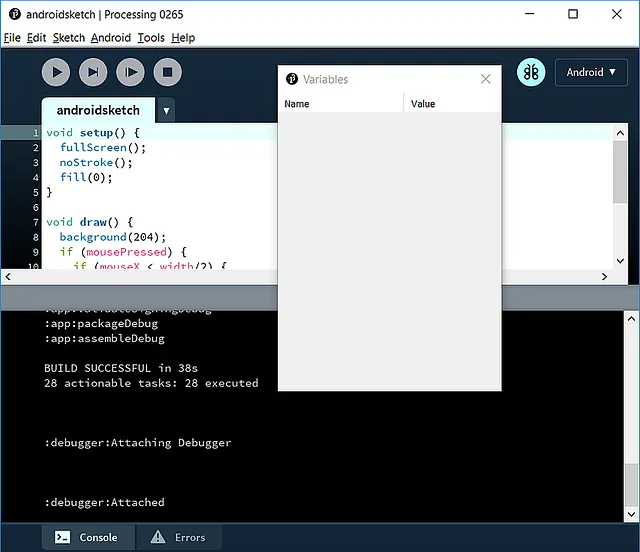

*Screenshot of Android Debugger. [image description: A window shows code for “androidsketch.”]*

## Implementing missing WebGL primitives in p5.js

Student: [Adil Rabbani](https://web.archive.org/web/20251011135633/https://adilrabbani.github.io/)

Mentor: Stalgia Grigg

[Medium Article](/web/20251011135633/https://medium.com/processing-foundation/gsoc-2018-my-summer-with-processing-foundation-5e5904e816fa)

*Adil Rabbani*

The project involved implementing missing WebGL primitives: arc, point, bezierVertex, curveVertex, quadraticVertex, and text in p5.js.

PS. text wasn’t implemented by me due to time constraints. It was implemented by another contributor to p5.js, and reviewed afterward by me and my mentors.

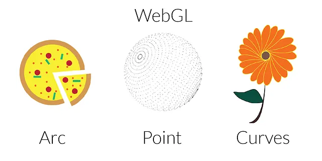

*New primitives for WebGL mode: arc, point, curves. [image description: Three rendered figures on a white background. The title says “WebGL.” On the left is a graphic of a pizza labelled “Arc.” In the middle is a sphere made of points labelled “Point.” On the right is daisy flower with orange petals, a stem, and a leaf, labelled, “Curves.”]*

## Processing Sound 2.0

Student: [Kevin Stadler](https://web.archive.org/web/20251011135633/https://kevinstadler.github.io/)

Mentor: Casey Reas

[Kevin Stadler](https://web.archive.org/web/20251011135633/https://kevinstadler.github.io/)

 successfully undertook a complete rewrite of [Processing’s Sound library](https://web.archive.org/web/20251011135633/https://github.com/processing/processing-sound). While his fully backwards-compatible re-implementation based on a Java synthesis engine greatly improved Processing Sound support for platforms such as Android and Raspberry Pi, the library’s example sketches also received a complete overhaul, with an eye on making library usage even easier for beginners.

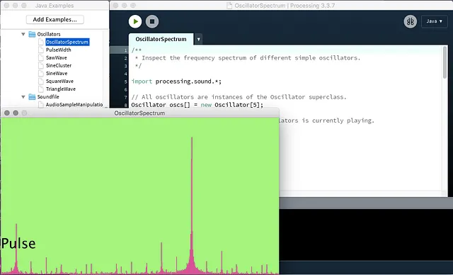

*New example to reveal the frequency spectrum of different oscillators. [image description: A window of Processing code for a program named “OscillatorSpectrum” is shown in the background. In the foreground is the resulting program, which shows a window with a green background, the text “Pulse,” and at the bottom of the window, a sound graph is rendered in hot pink.]*

## AR Renderer: Processing -Android

Student: Syam Sundar K

Mentors: Andres Colubri & Jesus Duran

[Visual Outcome](https://web.archive.org/web/20251011135633/https://youtu.be/sfpSNW_ElD4)

*Syam Sundar K*

An ARcore Renderer was created which focuses on creating Augmented Reality applications using Processing — Android, that will be able to render 3D Objects onto the Real World scene using Processing code in realtime. In addition, some sample applications were created to demonstrate the potential outcome of the library. Currently the Library is in testing stage —it’s merged under the “ar” branch of the Processing-Android Repo and will soon make it to the master branch.

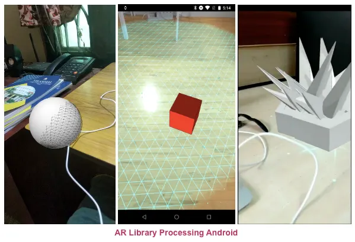

*Examples of from the new AR library in Processing-Android. [image description: An image divided into three vertical sections. On the left, a 3D sphere is rendered in a photograph. In the middle a grid and a 3D red cube is rendered in a photograph. On the right, a 3D shape of spikes emerging from a rectangular cube is rendered in a photograph.]*

## Processing for Pi website and tutorials

Student: [Maksim Surguy](https://web.archive.org/web/20251011135633/https://twitter.com/msurguy?lang=en)

Mentor: [Gottfried Haider](https://web.archive.org/web/20251011135633/https://ghai.xyz/)

[Project URL](https://web.archive.org/web/20251011135633/http://pi.processing.org/)

[Project Source Code](https://web.archive.org/web/20251011135633/https://github.com/processing/processing-pi-website)

*Maksim Surguy*

The result of this project is a website and a set of highly detailed tutorials for working with Processing on Raspberry Pi single board computers. There are two parts of this project that go hand-in-hand:

The website aims to provide guidance for people that want to use Processing with sensors, buttons, cameras, and other connected devices. It also serves as a platform for future tutorials and contributions.

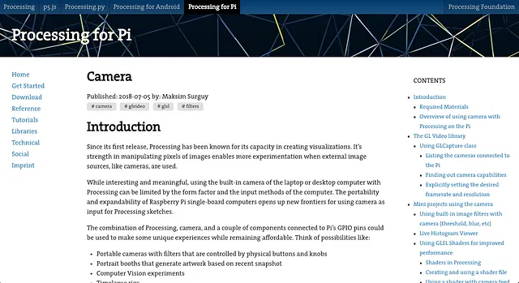

*Screenshot of the webpage for Processing for Pi. [image description: A screenshot of the webpage for Processing for Pi, showing the article for “Camera.”]*

## Dynamic Learning

Student: Jithin KS

Mentor: Saber Khan

*Jithin KS*

The project involved development of a webapp called Dynamic Learning, which is an online platform where STEM teachers and creative coders can collaborate to create lessons that include interactive visualizations created in p5.js. The main goal of this year’s GSoC was to lay down a foundational structure for the app on which future developments could be made and which can be used to obtain feedback from teachers for further improvements.

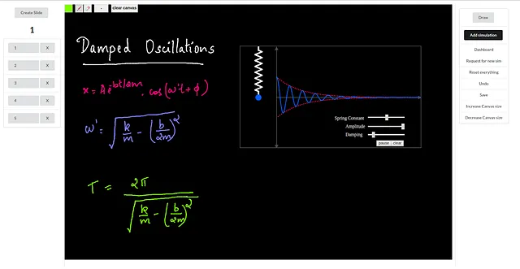

*A slide in the Lesson plan creator. On the left is the list of slides in the lesson plan, in the middle, the canvas which holds a simulation and some writings, and on the right, the menu bar. [image description: Most of the frame is filled with a black square that has handwriting in different colors on it. The text reads “Damped Oscillations” and shows mathematical equations and diagrams. On the left side of the image is a list of the number of slides. This image shows that we are on the first slide. On the right side of the image is a menu with buttons that include: “Draw, Add Simulation, Dashboard, Request for new sim, Reset everything, Undo, Save, Increase Canvas Size, Decrease Canvas size.”]*

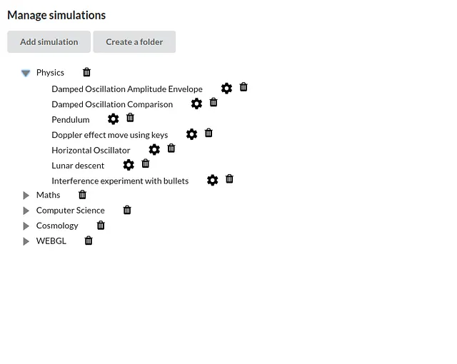

*Organizing contents using nested file structures. Folders can be made and the simulations can be added to the folder by dragging them into it. [image description: A window with the heading “Manage Simulations,” and two buttons, “Add Simulation” and “Create a folder.” A nested file structure below the title shows the main folders as, Physics, Maths, Computer Science, Cosmology, and WEBGL. The Physics folder has been dropped down, and nested within it are: Damped Oscillation Amplitude Envelope, Damped Oscillation Comparison, Pendulum, Doppler Effect move using keys, Horizontal Oscillator, Lunar Descent, and Interference experiment with bullets. Beside each folder and subfolder heading are trash and gear icons.]*

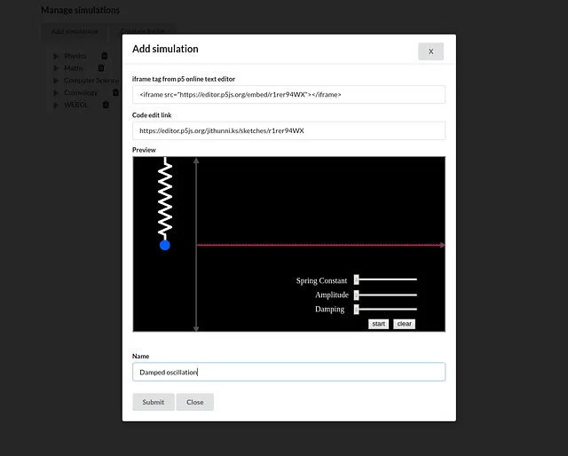

*Simulations can be added using the iframe export feature in the p5 online text editor. The first field takes in the iframe tag of the simulation, and the second field takes in the code edit link obtained from the online text editor. [image description: A window with the heading “Add Simulation” gives code for the iframe tag from the p5 online text editor. There are two text fields below this, and then a preview image that takes up much of the window. A field offers the link for “Code edit link.” Below this, the preview image shows the same oscillation image as the simulation before. At the bottom of the window, the user can give the simulation a name and click on of two buttons, either Submit or Close.]*

## Development Environment: Beginner/New User Experience Features

Student: Jae Hyun

Mentor: Elie Zananiri

[Repository 1](https://web.archive.org/web/20251011135633/https://www.github.com/jaewhyun/GettingStarted)

, [repository 2](https://web.archive.org/web/20251011135633/https://www.github.com/jaewhyun/ReferenceTool)

*Jae Hyun*

The project involved developing two contributed Tools for New/Beginner users. The Getting Started Tool consists of several frames that give new users a short tour of the PDE, since the current splash page doesn’t contain any information on how to use the PDE. The Reference Tool provides a built-in reference feature and eliminates the need for users to open up a browser to find a Processing Reference. It supports a search function, not only by the reference names but also by descriptions and examples of references that may contain the search text.

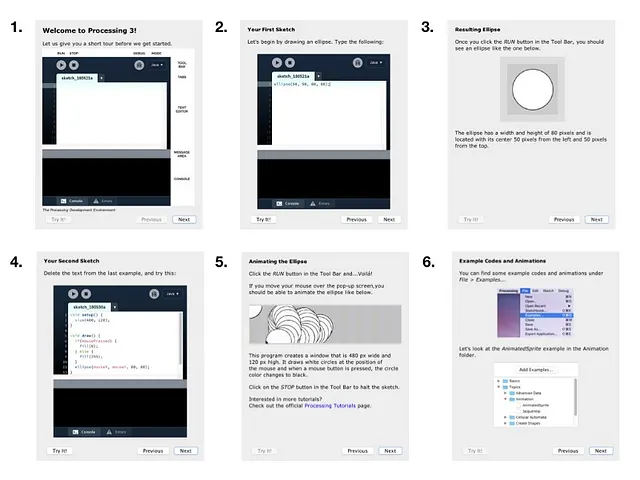

*Getting Started Tool frames 1–6. [image description: Six screenshots of the frames in the new Getting Started Tool tour. Each frame shows an image with text about a specific feature in Processing 3. The first six, shown above, include: Welcome to Processing 3!, Your First Sketch, Resulting Ellipse (which shows the resulting program from the previous frame), Your Second Sketch, Animating the Ellipse, and Example Code and Animations).]*

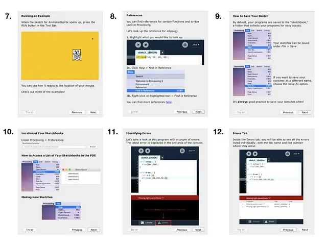

*The next six frames from the new Getting Started Tool. [image description: Six screenshots of the frames in the new Getting Started Tool tour, depicting frames 7–12. Each frame shows an image with text about a specific feature in Processing 3. The frames shown above, include: Running an Example, References, How to Save Your Sketch, Location of Your Sketchbooks, Identifying Errors, and Errors Tab.]*

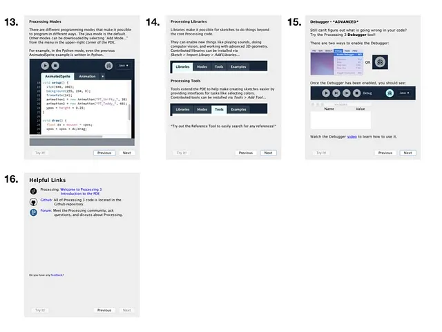

*The final four frames from the new Getting Started Tool. [image description: Four screenshots of the frames in the new Getting Started Tool tour, depicting frames 13–16. Each frame shows an image with text about a specific feature in Processing 3. The frames shown above, include: Processing Modes, Processing Libraries, Debugger *Advanced*, and Helpful Links.]*

## A Platform for algorithmic composition on p5.js-sound

Student Name: [Chan Jun Shern](https://web.archive.org/web/20251011135633/https://junshern.github.io/)

Mentor: Jason Sigal

*Chan Jun Shern*

My project this summer had the goal of making [p5.js-sound](https://web.archive.org/web/20251011135633/https://github.com/processing/p5.js-sound) a friendly platform for algorithmic music composition tasks.

In line with this objective, work for the project involved building up features, fixing bugs, adding documentation, and producing examples of p5.js sketches related to algorithmic composition.

To encourage the use of these features and resources we’ve built for algorithmic composition, the project culminates in an [online tutorial](https://web.archive.org/web/20251011135633/https://junshern.github.io/algorithmic-music-tutorial/) that walks through a number of examples and best practices for algorithmic composition on p5.js-sound.

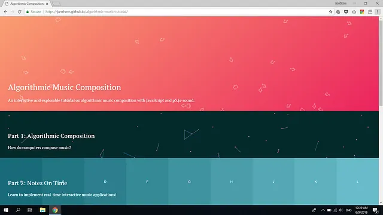

*The homepage for the project’s culminating interactive tutorial on Algorithmic Music Composition. [image description: A screenshot of a browser window split into three parts, each with a different color and a few simple graphics made of lines. The top part, which has a gradient of pink to orange and music note symbols, reads, “Algorithmic Music Composition, An interactive and explorable tutorial on algorithmic music composition with JavaScript and p5.js-sound.” The middle part, which is a dark green, and has symbols of lines and points, reads, “Part 1: Algorithmic Composition, How do computers compose music?” The bottom part, which shows a scaled gradient of blue-green, and different letters, reads, “Part 2: Notes on Time, Learn to implement real-time interactive music applications!”]*

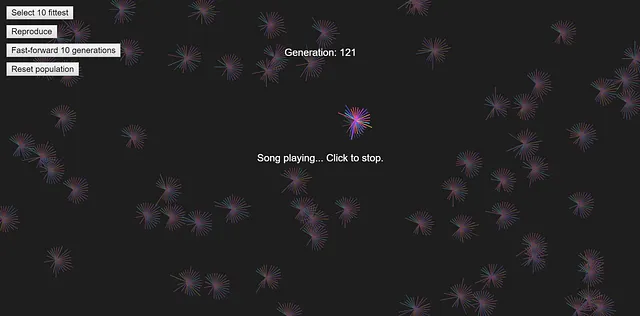

*The genetic music example demonstrates the use of evolutionary techniques to “breed” a population of the fittest songs according to some “musical fitness” rules. [image description: A black background with sporadic clusterings of small bursts of lines in red and green. The text in the upper left hand corner reads like a menu: “Select 10 fittest, Reproduce, Fast-forward 10 generations, Reset population.” In the center of the image, near the top, the text reads, “Generation: 121.” Below it is one of the shapes of bursts of lines, its colors brighter than the rest, in hot pink, yellow, red, blue, and green. The text in the center of the image reads, “Song playing… Click to stop.”]*

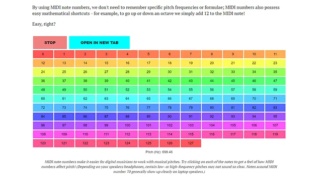

*Part of the tutorial written for the project, explaining the usage of MIDI note numbers to represent pitch information. [image description: A chart of different colors that show different frequencies of pitch as they correspond to MIDI note numbers. Text at the top of the image reads, “By using MIDI note numbers, we don’t need to remember specific pitch frequencies or formulae; MIDI numbers also possess easy mathematical shortcuts — for example, to go up or down an octave we simply add 12 to the MIDI note! Easy, right?” The text at the bottom of the chart reads, “MIDI note numbers make it easier for digital musicians to work with musical pitches. Try clicking on each of the notes to get a feel of how MIDI numbers affect pitch! (Depending on your speakers/headphones, certain low- or high-frequency pitches may not sound so clear. Notes around MIDI number 70 generally show up clearly on laptop speakers.”]*

## Improvements to I/O methods for p5.js

Student: [Tanvi Kumar](https://web.archive.org/web/20251011135633/https://github.com/TanviKumar)

Mentor: Alice M. Chung

*Tanvi Kumar*

My project this summer revolved around improving the I/O methods of p5.js. Resolving existing issues in I/O, and testing methods and various file types on different browsers was a major part of my work. A system to issue a warning to the user when very large files are loaded was added. I was also able to successfully improve examples, add documentation, and make additions to p5.dom.js.

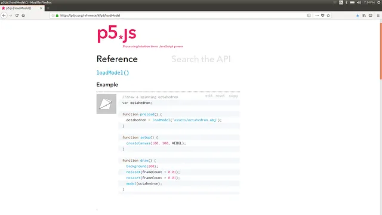

*[image description: A reference article for loadMode1() on p5.js]*

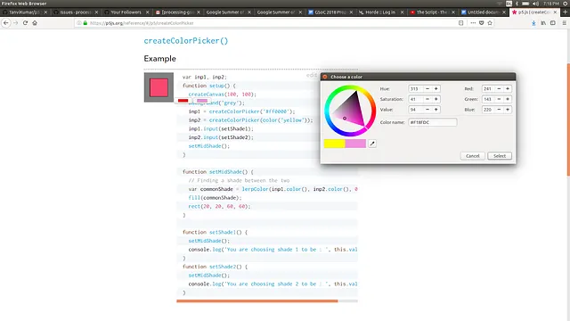

*[image description: A new example for createColorPicker().]*

## GLSL Editor for Processing

Student:** **Izza Tariq

Mentor:** **Andres Colubri

[Website](https://web.archive.org/web/20251011135633/https://github.com/Izza11/GLSL-Editor-Processing)

*Izza Tariq*

I developed a code-based (GLSL) shader editing tool for the Processing Development Environment (PDE) that updates the PDE sketch display window in real-time without having to compile the code repeatedly. The tool opens as a separate window consisting of a text editor on the left and a rendered display on the right. Existing shaders are automatically loaded in the editor on startup. Default shaders are loaded if no shader exists in the sketch folder. Shader code is saved to shader files in the sketch folder in real-time as well. Almost all of the goals of the project were met, except for the naming conflict between some of Shdr and PDE’s default shader uniform variables. Due to this issue the tool’s own rendered display does not get updated.

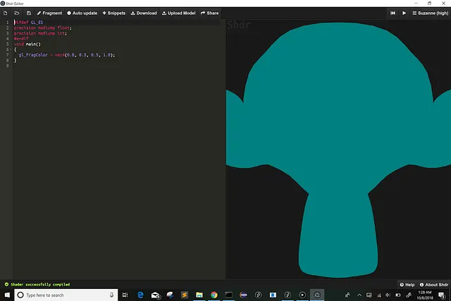

*[image description: A screenshot of the Shdr editor, with code on the left side of the window, and the results on the right.]*

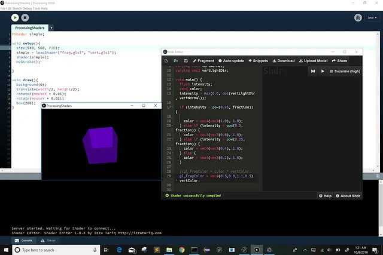

*A screenshot of a Processing sketch that uses new shader code. [image description: A Processing sketch window with code and its results displayed in a new window. There is also a window for the Shdr Editor open.]*

## New JavaScript console in p5.js web editor

Student: Liang Tang

Mentor: Cassie Tarakajian

*Liang Tang*

My project for this summer was to integrate a new console to p5.js web editor. The two main tasks that I focused on were:

a) Folding/unfolding of console logged objects,

b) Repeated console logs are not duplicated (but displayed with a number displaying times logged),

c) Support the presentation of different data formats;

2. Make the console interactive.

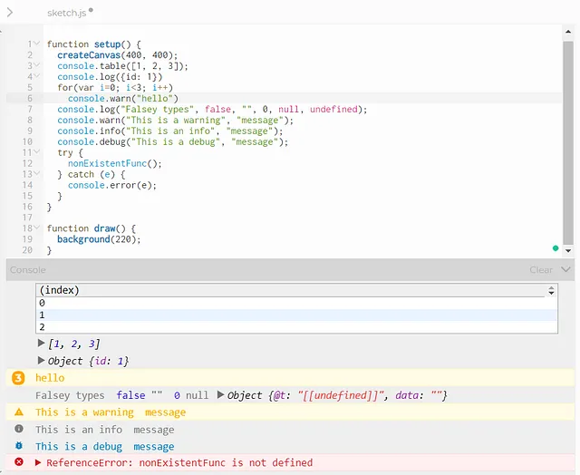

*Improvements to the console editor in p5.js. [image description: A p5.js sketch showing new console functions like console.log(), console.warn(), and console.debug().*

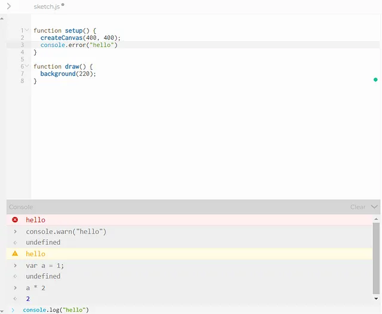

*New console() functions. [image description: A sketch showing the results of the function console.error().]*

## Improvements to WebGL mode in p5.js

Student Name: Aidan Nelson

Mentor: Kate Hollenbach

*Aidan Nelson*

This summer, I worked with my mentor to implement a number of ease-of-use improvements to p5.js’ WebGL (3D) mode. These changes aimed to allow a beginner coder to visualize and understand 3D space. Specifically, it is now possible to turn on a “debugMode” that helps orient users in space. There are more options for controlling the camera view interactively with the mouse (orbitControl), and camera functionality has been reorganized into an object with an expanded API. I hope this helps beginner coders feel more comfortable working in 3D with p5.js!

*New features debugMode() and orbitControl() give a clear sense of 3D space. [image description: An animated gif shows a grid of boxes move up and down in 3D space as our view rotates around the scene.]*

## Updating hello.p5js.org

Student: Elgin-Skye McLaren

Mentor: Evelyn Masso

*Elgin-Skye McLaren*

For my GSOC project, I created a new interactive hello.p5js video trailer and website to welcome new users to the p5 community. I wrote the script and gathered video content and sketches from community volunteers. I built the new website using tools including NodeJS, Browserify, and Plyr. The site features multilingual captions, interactive sketches, and adapts to different screen sizes/devices. I’m currently working with my mentor to launch the revised site.

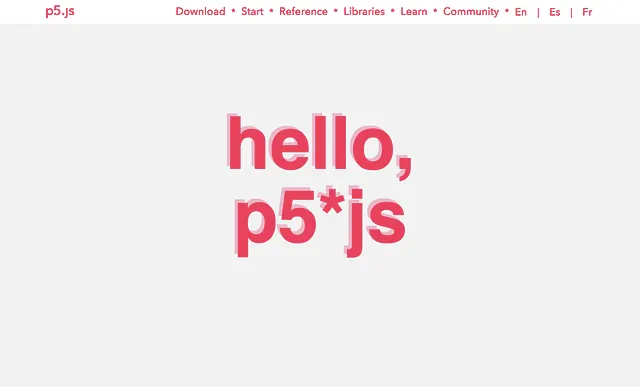

*[image description: A screenshot of the hello.p5js video shows the text “hello, p5*js” in hot pink on a gray background.]*

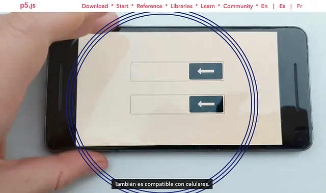

*[image description: A screenshot of the hello.p5js video shows a phone being held in close-up by a hand. The caption, in Spanish, reads, “También es compatible con celulares.”]*

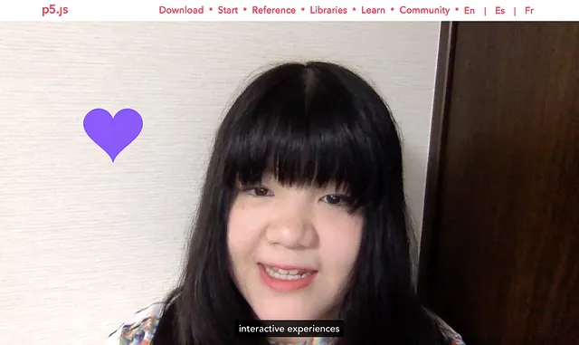

*[image description: A screenshot showing a person with a purple heart rendered next to their head. The caption reads “interactive experiences.”]*

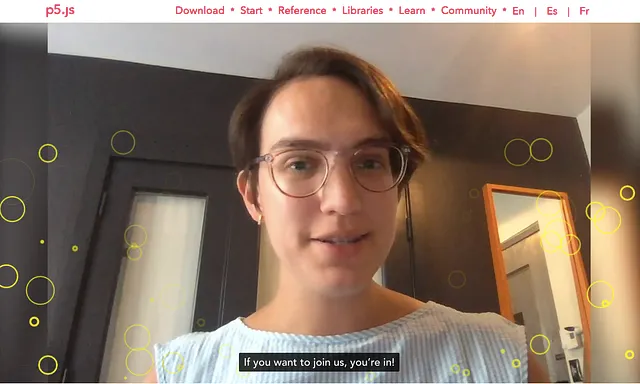

*[image description: A screenshot shows yellow circles of varying shapes drawn around a person. The caption reads, “If you want to join us, you’re in!”]*

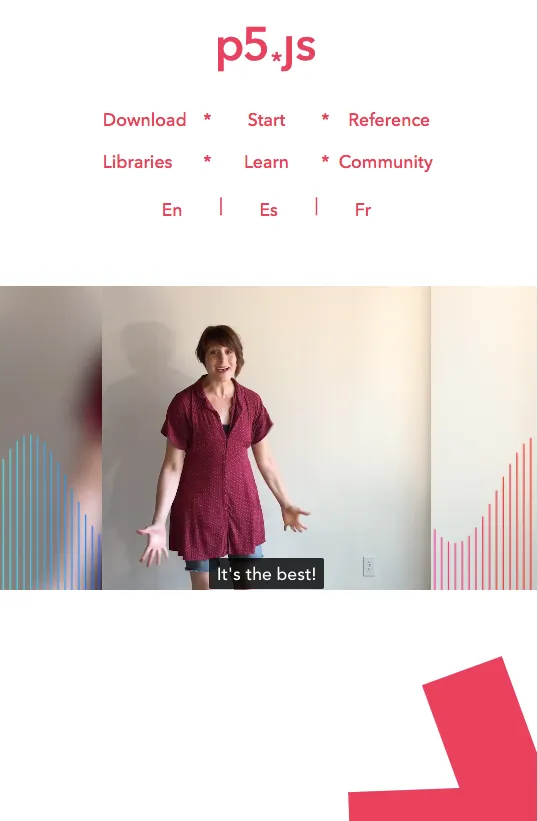

*[image description: A screenshot that includes part of the p5.js browser. At the top, in hot pink text, is a menu that reads, “p5.js: Download * Start * Reference * Libraries * Learn * Community. en | es | fr.” In the center is video a person with lines charted around them in waves; the caption at the bottom of the video reads, “It’s the best!” On the bottom of the image is white background, with a portion of a large, hot pink asterisk in the lower right corner.]*

## APDE Beta Push

Student: William Smith

Mentor: Sara Di Bartolomeo

APDE (Android Processing Development Environment) is a fully functional IDE for creating Processing sketches on Android devices, but was in need of improvements to keep it up-to-date with the desktop version of Processing and to improve its accessibility to new users.

## Test strategy for maintaining and updating mobile  
functionality of p5.js

Student: Sithe Ncube

Mentor: Lee Tusman

*Sithe Ncube*

The main goal of the project was to design a test strategy and extensively test and update the p5.js mobile functionality so that compatibility issues can be tracked easily with updates to the library and mobile platforms. A lot of the project involved performing visual tests on various devices both real and virtual.

Part of this project included a testing event in the form of a creative coding workshop in Port Elizabeth, South Africa, that will allow users to learn and test the mobile functionality of p5.js, as well as possibly catch further issues on unfamiliar devices.

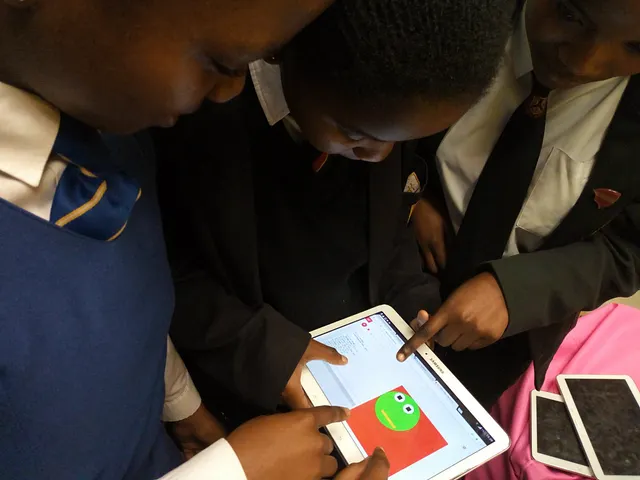

*Students from creative coding workshop in Port Elizabeth completing a p5.js exercise on tablet. [image description: Three children huddle around and point to a tablet that shows a p5.js sketch.]*

---

*Originally published on [Medium](https://medium.com/processing-foundation/2018-google-summer-of-code-grand-wrap-up-post-c13a5ea449e8). Archived 2026-03-09.*
