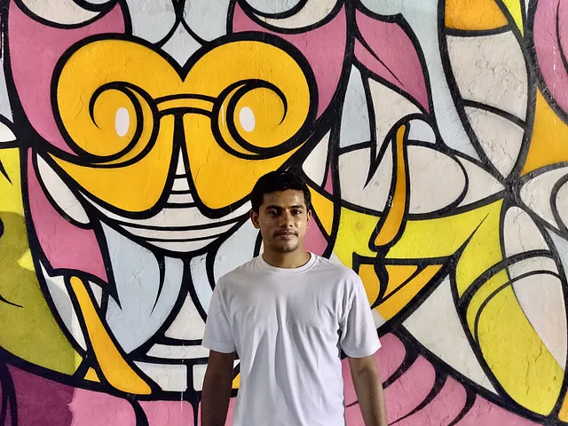

# Google Summer of Code 2019 Wrap-up Post

*

This summer was the Processing Foundation’s eighth year participating in Google Summer of Code, where we worked with students on open-source projects that ranged from software development to community outreach. Several of our students wrote articles, discussing their projects in their own words, which you can read ***[here](https://web.archive.org/web/20251011135613/https://medium.com/processing-foundation/pfgsoc/home)*. Below are short descriptions of every 2019 GSoC student’s work, as well as links for more information. We’re so proud of all the accomplishments of this year’s cohort!*

## Rachel Lim

### [Search Bar for Sketches in the p5.js Web Editor](/web/20251011135613/https://medium.com/processing-foundation/search-bar-for-sketches-in-the-p5-js-web-editor-e6e9cda3909d)

mentored by Cassie Tarakajian

This project provided more convenience for organizing and retrieving sketches within an individual account through a search bar and a collections tab. Inspired by my classmates (and myself!), who love to keep the playful titles but have extreme difficulty finding anything because we’re unwilling to change them.

[Click here for Rachel’s article on her project](/web/20251011135613/https://medium.com/processing-foundation/search-bar-for-sketches-in-the-p5-js-web-editor-e6e9cda3909d)

[Click here for Work Product Report](https://web.archive.org/web/20251011135613/https://github.com/raclim/p5.js/blob/rachellim/developer_docs/project_wrapups/rachellim_gsoc_2019.md)

[Click here for Github](https://web.archive.org/web/20251011135613/https://github.com/processing/p5.js-web-editor/pull/1132)

## Sanket Singh

### [Advancing p5.js’s WebGL mode](/web/20251011135613/https://medium.com/processing-foundation/advancing-p5-jss-webgl-mode-8b987ddfd4bf)

mentored by Adam Ferriss

WebGL is a web version on OpenGL, i.e a 3D engine. It allows you to make 3D materials in the browser, using JavaScript. It is rendered using the GPU and thus is more performant than regular canvas, so it is also used for 2D games. This project aims to implement some new functionalities for p5.js using WebGL, to expand the current functionality related to lighting, to introduce younger artists to the fabulous world of Computer Graphics.

[Click here for Sanket Singh’s article about his project](/web/20251011135613/https://medium.com/processing-foundation/advancing-p5-jss-webgl-mode-8b987ddfd4bf)

Click the links below for Github:

- [A new parser to load STL files using loadModel()](https://web.archive.org/web/20251011135613/https://github.com/processing/p5.js/pull/3675)
- [lightFalloff()](https://web.archive.org/web/20251011135613/https://github.com/processing/p5.js/pull/3786)
- [emissiveMaterial()](https://web.archive.org/web/20251011135613/https://github.com/processing/p5.js/pull/3820)
- [specularColor()](https://web.archive.org/web/20251011135613/https://github.com/processing/p5.js/pull/3843)
- [spotLight()](https://web.archive.org/web/20251011135613/https://github.com/processing/p5.js/pull/3913)
- [frustum()](https://web.archive.org/web/20251011135613/https://github.com/processing/p5.js/pull/3927)
- [noLights()](https://web.archive.org/web/20251011135613/https://github.com/processing/p5.js/pull/3955)

## Jiwon Shin

### [Updating and Improving p5.Serial](/web/20251011135613/https://medium.com/processing-foundation/updating-and-improving-p5-serial-9e38f70946ba)

mentored by Shawn Van Every

Originally developed by Shawn Van Every, p5.serial is a commonly used library to connect serial devices to p5.js sketches. Despite its wide use, it has not been actively maintained since 2017. Jiwon updated and made improvements to the functionality of the p5.serial library. [p5.serialport](https://web.archive.org/web/20251011135613/https://github.com/p5-serial/p5.serialport) is now capable of connecting multiple microcontrollers over multiple web clients and [p5.serialcontrol](https://web.archive.org/web/20251011135613/https://github.com/p5-serial/p5.serialcontrol/releases/tag/0.1.1) desktop application was re-designed and updated to match the newly developed functionalities.

[Click here for Jiwon Shin’s article about her project](/web/20251011135613/https://medium.com/processing-foundation/updating-and-improving-p5-serial-9e38f70946ba)

- [p5.serialport](https://web.archive.org/web/20251011135613/https://github.com/p5-serial/p5.serialport) — A p5.js library that enables communication between your p5 sketch and Arduino (or another serial enabled device).
- [p5.serialcontrol](https://web.archive.org/web/20251011135613/https://github.com/p5-serial/p5.serialcontrol) — GUI (Electron) application for use with p5.serialport
- [API Documentation Website](https://web.archive.org/web/20251011135613/https://p5-serial.github.io/) — API documentation for p5.serialport

## Ashneel Das

### [Visualizing STEM education with Dynamic Learning](/web/20251011135613/https://medium.com/processing-foundation/visualizing-stem-education-with-dynamic-learning-4106748c6fcd)

mentored by Nick McIntyre

This project will improve and extend Dynamic Learning, a project created by Jithin KS as part of his 2018 Google Summer of Code project. Dynamic Learning is a platform in which teachers and programmers can collaborate with one another to create visualizations of common STEM topics. My project will improve this application by focusing on three major areas of extension: interface changes and responsiveness, integration with other software, and classroom usability improvements. I will also add a few miscellaneous improvements towards the end of the project.

[Click here for Ashneel’s article about his project](/web/20251011135613/https://medium.com/processing-foundation/visualizing-stem-education-with-dynamic-learning-4106748c6fcd)

[e407a11](https://web.archive.org/web/20251011135613/https://github.com/JithinKS97/dynamic-learning/commit/e407a11cf36da26cf57abbc849542e3e35420fef)

[c7f6e84](https://web.archive.org/web/20251011135613/https://github.com/JithinKS97/dynamic-learning/commit/c7f6e84d0e35fde586dd42cb44d36ea628387853)

[cf66230](https://web.archive.org/web/20251011135613/https://github.com/JithinKS97/dynamic-learning/commit/cf66230c0c4a00012e294ecddd0551ca24776203)

[9b6c881](https://web.archive.org/web/20251011135613/https://github.com/JithinKS97/dynamic-learning/commit/9b6c88121a397b453876e4f204744551255015e4)

[2941433](https://web.archive.org/web/20251011135613/https://github.com/JithinKS97/dynamic-learning/commit/2941433e4a709723af40dda0bb0ae4a487926b20)

- Responsiveness in the lesson plan area.

[642a328](https://web.archive.org/web/20251011135613/https://github.com/JithinKS97/dynamic-learning/commit/642a328f8526bf002830e9c4fcb99e5c495513cd)

[1ae750d](https://web.archive.org/web/20251011135613/https://github.com/JithinKS97/dynamic-learning/commit/1ae750dee0058753028d4af3a903ed16743ce01c)

[86f2a97](https://web.archive.org/web/20251011135613/https://github.com/JithinKS97/dynamic-learning/commit/86f2a97332b9cb22cc3e69ba07c06c303032c071)

[623e912](https://web.archive.org/web/20251011135613/https://github.com/JithinKS97/dynamic-learning/commit/623e912925f05b3095d7bd0af83343d3e1f921a8)

[d36a53e](https://web.archive.org/web/20251011135613/https://github.com/JithinKS97/dynamic-learning/commit/d36a53ee8422a5a5041c64125f0382345d510275)

[19b198e](https://web.archive.org/web/20251011135613/https://github.com/JithinKS97/dynamic-learning/commit/19b198e6b5984c0746a089446ddd7e1bda4ff46e)

- Created a structured classroom environment.

[7ff4e81](https://web.archive.org/web/20251011135613/https://github.com/JithinKS97/dynamic-learning/commit/7ff4e81083fbaac187afcf5ddda6971a10fe26a4)

*Alexandra Cheng*

*Oskar Garcia*

## Alexandra Cheng & Oskar Garcia

### Math in Motion

mentored by Greg Benedis-Grab and Ellen Nickles

Math in Motion (MiM) is a modern interface for working with math on the web. It has a short learning curve and makes it easier to input, edit, and display math on the screen. Since it’s built with core web technologies, it can be used by anyone with a browser.

MiM allows you to work with math just like you would with pencil and paper. It has useful features like syntax highlighting, text and math notation modes, and copy/paste functionality. MiM makes it easier to show your work and edit it on the fly.

Our goal is to make math more accessible, scalable, and interactive.

## Jenna Xu

### [Code Slang](https://web.archive.org/web/20251011135613/https://editor.p5js.org/code_slang/embed/QQEgilJDk)

mentored by Sharon De La Cruz

I would love to help develop a javascript library that is flexible, intuitive and human; whose syntax resembles natural language more than programming language; that transforms programming into a fun conversation with the computer rather than a rigid set of logical commands.

*Arihant stands in front of a mural painted with the colors pink, yellow, white, and black. He is wearing a white t-shirt and looking directly at the camera.*

## Arihant Parsoya

### Completing p5.py API and improving documentation

mentored by Sam Lavigne and Abhik Pal

The aim of this project was to make p5.py ready for public use by completing the APIs to make it on par with Processing and p5.js. Examples and tutorials for the modules were added to make it more accessible to the Python community. Apart from adding new APIs, I also fixed the existing issues in p5.py and added test suit to the library, which will help in keeping the library stable as it grows in the future.

Click for Github [link 1](https://web.archive.org/web/20251011135613/https://github.com/p5py/p5/pull/121) and [link 2](https://web.archive.org/web/20251011135613/https://github.com/p5py/p5/issues?utf8=%E2%9C%93&q=milestone%3A%22Google+Summer+of+Code+2019%22+)

## Ashley Kang

### Curating Community Creativity for p5.js 1.0

mentored by Kate Hollenbach

For my Google Summer of Code 2019 project, I worked with my mentor Kate Hollenbach to curate six projects from the online and offline p5.js community and to create a place for them on p5js.org. This involved creating new /showcase and /showcase/featuring pages to highlight creative and inclusive ways people have been engaging with p5.js, including but not limited to: making art and design, learning and teaching computation, improving and translating documentation, ensuring accessibility, integrating other libraries and devices, and contributing to open source. We also established an open nomination process for people to submit or nominate work to be featured, especially for educators and students throughout the school year.

## Urvashi Verma

### Improving p5.js Unit Tests

mentored by Evelyn Masso

This project focused on improving the unit tests as well as creating a more complete unit test coverage for p5.js. This project also included creating a tutorial for new contributors, covering the basics of unit testing for p5.js and how to write and add them.

Click the links below for Github

### Core

### Events

### Image

### Typography

### Utilities

### WebGL

## Deeraj Esvar R

### Maintenance of Android mode: SDK downloader/updater, emulator, library structure

mentored by Sarah Lensing and Cristian Mosquera

I proposed to work on the following:

- Implement an up-to-date SDK and Emulator installer.
- Enhance the SDK Updater by adding options like individual package update and solving existing issues, like fixing the progress bar .
- Test and find solutions to existing issues with the Android Emulator across platforms and add new features the Emulator Creator.
- Improve the project structure of Core Libraries and Library Template, and work on / look into the conversion of Libraries to kotlin.
- For any android based application, the SDK Installer/Updater/Emulator play an important role in maintaining packages and essentially rendering the output of the app. For any open source project it is essential to keep the project developer oriented and hence, re-structuring the library and library template on android standards is important.

[Click here for Deeraj’s article about his project](/web/20251011135613/https://medium.com/@deerajtheepshi/google-summer-of-code-2019-final-report-59513df76c72)

## Carlos L05 Garcia

### p5.touchgui

mentored by Yining Shi

p5.touchgui is intended to extend p5.js and make it easy to add buttons, sliders, and other GUI (graphical user interface) objects to p5.js sketches, enabling users to focus on quickly iterating ideas with easily created GUI objects that work with both mouse and multi-touch input.

## Syam Sundar K

### Processing Language Server

mentored by Manindra K Moharana

Processing Language Server focuses on creating a Language Server Protocol (LSP) implementation for Processing Programming Language. PDE is currently built using Java and using custom components of Swing Framework. The longterm goal of Processing is to replace this with a JS-based IDE to bring in more contributors and to make building UIs simple. While planning on building such IDE, LSP is of significant importance for any language because the IDE relies on it. Since Processing is the targeted Programming language, it’s quite important to build an LSP for the same. This shall act as a benchmark for all the crucial activities of the IDE such as auto-completion, go-to-definition, hover-insights, and so on. LSP will also help in easy and seamless integration of the above functionalities in any editor such as Atom, VScode, etc.

## Vedhant Agarwal

### Stabilizing and Improving p5.xr during Alpha Release

mentored by Stalgia Grigg

p5.xr is a library for p5.js that enables WebXR capabilities with p5 sketches. The goal of the library is to allow p5.js sketches to become multi-platform AR or VR projects with little added code. The capabilities of p5 will be greatly extended by this library, and, since it is in pre-alpha stage, it requires constant stabilization and testing while implementing new features.

Click the links below for work product reports

- [Replacing _update() with _updatexr()](https://web.archive.org/web/20251011135613/https://github.com/stalgiag/p5.xr/pull/21)
- [Pixelation](https://web.archive.org/web/20251011135613/https://github.com/stalgiag/p5.xr/pull/24)
- [p5xr Viewer class](https://web.archive.org/web/20251011135613/https://github.com/stalgiag/p5.xr/pull/28)
- [intersectsBox()](https://web.archive.org/web/20251011135613/https://github.com/stalgiag/p5.xr/pull/49)
- [intersectsSphere()](https://web.archive.org/web/20251011135613/https://github.com/stalgiag/p5.xr/pull/48)
-   
[getRayFromScreen()generateRay()](https://web.archive.org/web/20251011135613/https://github.com/stalgiag/p5.xr/pull/48)
- [intersectsPlane()](https://web.archive.org/web/20251011135613/https://github.com/stalgiag/p5.xr/pull/50)

## Alex Stamm

### Stabilizing Processing Video with GStreamer 1.x

mentored by Andres Colubri

The goal of this project was to stabilize the [Processing Video Library](https://web.archive.org/web/20251011135613/https://github.com/processing/processing-video) to v2.0, which is based on the GStreamer media framework. The aim here was to handle library-side back-end code so that users using the Processing Development Environment (PDE) can simply run their Processing editor for high-quality video playback, depending on user specifications. The tasks included upgrading the video framework, upgrading to a native buffer playback, improve capture support, tackling notable bugs, and providing documentation to better use the library. The goal is to handle the back-end framework seamlessly so that users can focus on easy video playback for their own projects.

## Oren Shoham

### Using Audio Workley in the p5.Sound library

mentored by Jason Sigal

For my GSoC 2019 project, I worked with my mentor Jason Sigal to add AudioWorklet support to p5.js-sound, allowing certain parts of the library to run more efficiently by moving custom audio processing to a separate audio thread. I also helped Jason integrate Webpack and Babel into the p5.js-sound Grunt build pipeline, allowing the library’s developers to use ES6 JavaScript features and laying the groundwork for modernizing the codebase and examples.

- [Add tests for p5.SoundRecorder and lint existing tests (#364)](https://web.archive.org/web/20251011135613/https://github.com/processing/p5.js-sound/pull/364)
- [Replace requirejs with webpack to enable ES6+ and non-AMD modules (#366)](https://web.archive.org/web/20251011135613/https://github.com/processing/p5.js-sound/pull/366)
- [Replace ScriptProcessorNode in p5.SoundRecorder with AudioWorkletNode (#369)](https://web.archive.org/web/20251011135613/https://github.com/processing/p5.js-sound/pull/369)
- [Replace ScriptProcessorNode with AudioWorkletNode in p5.SoundFile and p5.Amplitude (#373)](https://web.archive.org/web/20251011135613/https://github.com/processing/p5.js-sound/pull/373)
- [Add ring buffers to AudioWorklet processors to support variable buffer sizes (#376)](https://web.archive.org/web/20251011135613/https://github.com/processing/p5.js-sound/pull/376)
- [Bugfixes for p5.Amplitude and p5.Soundfile for browsers without AudioWorklet support (#380)](https://web.archive.org/web/20251011135613/https://github.com/processing/p5.js-sound/pull/380)

---

*Originally published on [Medium](https://medium.com/processing-foundation/google-summer-of-code-2019-wrap-up-post-3478323bb0ea). Archived 2026-03-09.*
