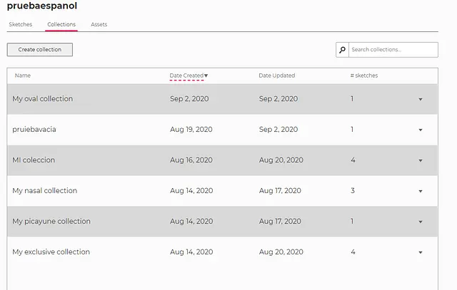
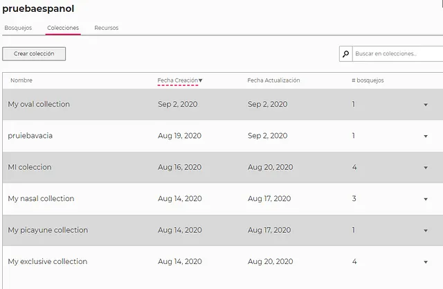
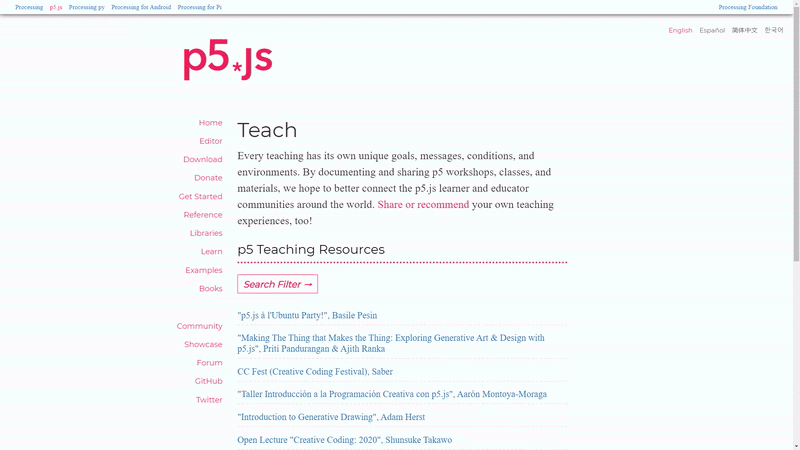
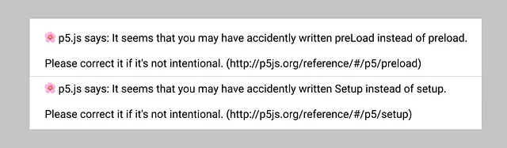
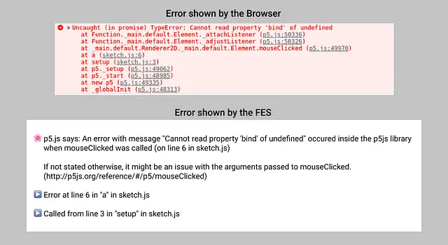
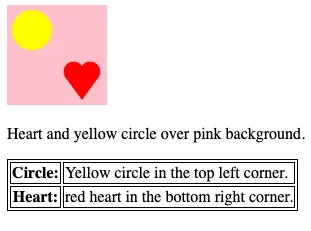
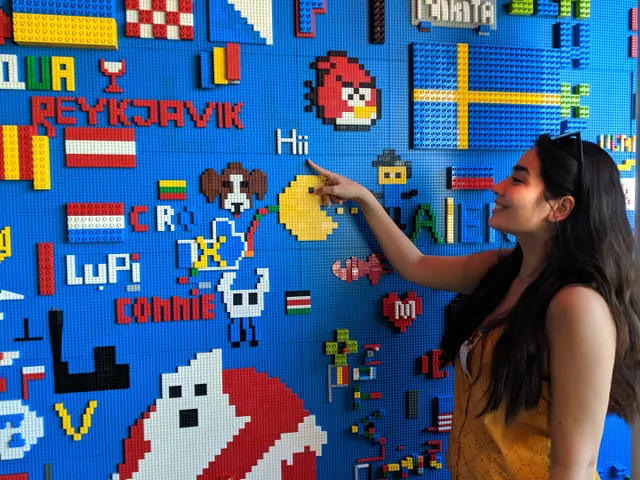
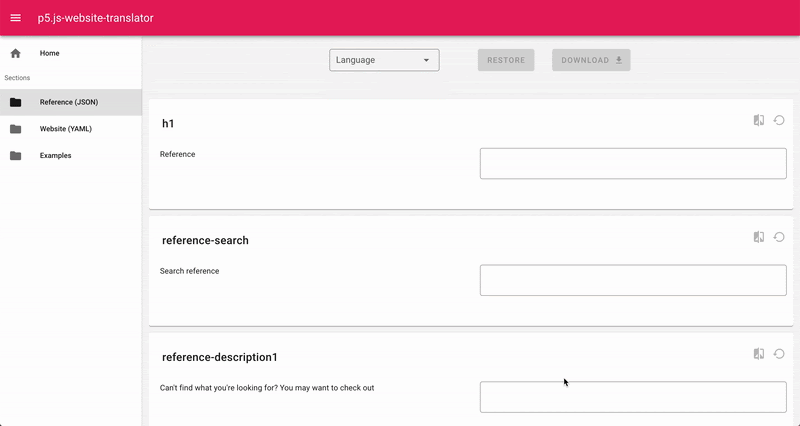
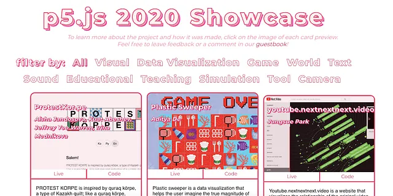
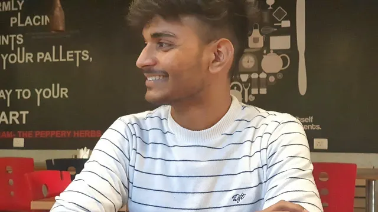

# Google Summer of Code 2020 Wrap-Up Post

This summer marks Processing Foundation’s ninth year participating in ***[Google Summer of Code](https://web.archive.org/web/20251011135634/https://summerofcode.withgoogle.com/)*! The GSOC program aims to get undergraduate students involved in open-source software by providing a summer stipend to work on a project of their choice. Students submitted proposals to work on an aspect of Processing, p5.js, Processing.py, and Processing for Android. We were able to offer 11 positions from a field of 90 applications.*

Several of our students wrote articles, discussing their projects in their own words, which you can read ***[here](https://web.archive.org/web/20251011135634/https://medium.com/processing-foundation/pfgsoc/home)*. Below are short descriptions of every 2020 GSOC student’s work, as well as links for more information. We’re so proud of all the accomplishments of this year’s cohort!*

note: Image Descriptions appear in the captions when they are too long to fit in Alt Text.*

**Omar Verduga** worked on Internationalization and Spanish Localization for the p5.js Web Editor. The p5.js Web Editor is a web-based code editor that lets artists, educators, and programmers create and share p5.js sketches online.

Omar was mentored by [Andrew Nicolaou](https://web.archive.org/web/20251011135634/https://andrewnicolaou.co.uk/), who was a Processing Foundation Fellow in 2017.

*“I’m a Mexican based in London. I did my Bachelor’s and Master’s Degree in Computer Science, and I’m currently finishing my PhD in Experimental Psychology. I have been involved in games, interactive art, academia, and other random stuff. You can find me on Github and Linkedin.”*

Currently the p5.js website supports translations for Spanish; however, the p5.js Web Editor included no translations. This project added the framework to internationalize the Web Editor and localize it in Spanish.

Expanding the accessibility for users in Latin America not only can reach a potential user base of 500 million users, but also inspire new usage and contributions from diverse communities.

Reaching these communities could have a greater impact on the diversity of ideas for growth for p5.js, and the most impact in accordance with the goals of the Processing Foundation.

The following functionality was introduced:

- How to switch back and forth between languages
- How to serve the translations just once per language
- Dynamically load the translations when required
- How to save the user’s preferred language
- Provide the actual translations in Spanish for the web page components

[Click here for Work Product Report on Medium](/web/20251011135634/https://medium.com/processing-foundation/internationalization-and-spanish-localization-for-p5-js-web-editor-6140ade3f7df)

[Click here for Github Repo](https://web.archive.org/web/20251011135634/https://github.com/oruburos/p5.js-web-editor)

*The English version…*

*…and the Spanish version.*

**Ghales Trilo **worked on improving the experience of the Web Editor on phones and tablets by detecting, validating, studying, and providing solutions for weak points on the mobile and tablet experience.

Ghales was mentored by Cassie Tarakajian, who is the current lead maintainer of the p5.js Web Editor.

*“I’m a 24-year-old software developer, musician, and digital creator from Brasilia (Brazil), and a sophomore at the University of Brasilia. I’ve been a full-stack engineer at Ribon for a year and a half, and today act as a web freelancer. I compose music and create art with code, using TidalCycles and p5, and most projects can be found on my homepage. You can find me on github and linkedin, too.”*

I developed a mobile-friendly interface for the p5.js Web Editor. While lacking some features of the desktop version, it’s fully functional, and now has clear directions towards a final version. In the future, I see an in-app tutorial and a live display, and the interface will surely undergo improvements after being tested. GSoC helped me understand better what being a developer can mean — I learned valuable lessons on self-management, and developed UI/UX skills, which I didn’t have. It was an awesome challenge!

[Click here for project post on Github](https://web.archive.org/web/20251011135634/https://github.com/processing/p5.js/blob/main/contributor_docs/project_wrapups/ghalestrilo_gsoc_2020.md)

.

**Inhwa Yeom** reached out to educators around the world, with the aim to contribute to documenting, showcasing, and sharing teaching experiences, specifically by re-using the existing features of p5js.org.

She was mentored by [Qianqian Ye](https://web.archive.org/web/20251011135634/http://www.qianqian-ye.com/), who was a Processing Foundation Fellow in 2019. With Seonghyeon Kim, Inhwa was a [2020 Processing Foundation Fellow](/web/20251011135634/https://medium.com/processing-foundation/p5-js-for-ages-50-in-korea-50d47b5927fb).

*“I’m a M.S. student of Culture Technology and research assistant of UVR Lab at KAIST. In my research projects, I design, develop, and evaluate AR/VR systems for collaborative creations and learning, mainly in consideration of people with less familiarity or accessibility to 3D interfaces and interactions. Please feel free to contact me via my linkedin, github, and instagram :).”*

The purpose of my “p5 for 50+ teaching” project was to collect information on p5.js workshops, classes, or relevant materials currently scattered across the Web. I wanted to archive and visualize the information on a single webpage of p5js.org, namely [p5js.org/teach](https://web.archive.org/web/20251011135634/https://p5js.org/teach/). Addressing the need for better access to educational experiences and resources, my mentor Qianqian and I hope to contribute with this webpage in connecting and consolidating the p5.js educator and learner community around the world.

*p5js.org/teach webpage. [Image description: A webpage of p5js.org, with title “teach” and subtitle “p5 Teaching Resources”]*

**Akshay Padte **worked on making p5.js’s Friendly Error System even friendlier. This project aimed primarily to extend the functionality of the FES, by adding new features that will help beginners when they start learning.

Akshay was mentored by [Stalgia Grigg](https://web.archive.org/web/20251011135634/https://stalgiagrigg.name/), who was a 2019 p5.js Fellow.

*“I am a 20-year-old undergraduate student of Computer Engineering based in Mumbai, India. I like building small and medium projects for fun and I also enjoy travelling to distant places for hackathons, CTFs, and other contests (pictured: me in Finland, originally for a hackathon). This is my first time in Google Summer of Code and I am thrilled to be working on this project on p5, a library that I have come to love so much! You can reach me on my Linkedin and Github.”*

I worked on improving the existing FES, firstly by addressing a few problems with speed, size, and clarity. In doing so I was able to reduce the p5.js library size by 25% and cut down the time required for many function calls by up to half. I also added two new features, which aim to help with some common mistakes students can make:

First, the FES now has a spellcheck system to identify errors resulting from spelling and capitalization mistakes (such as using createcanvas() instead of createCanvas(), using Setup() instead of setup(), colour() instead of color(), etc).

*Catching spelling/capitalization mistakes which may lead to problems in the sketch.*

Second, the FES can now detect global errors, even those which might not be directly related to p5.js. It can differentiate between errors that happened inside p5.js and those that happen in the user-sketch, while providing friendly messages and links to help in resolving the error. It can even simplify the stack trace of an error, highlighting only the important details.

[Click here for Work Product Report on Medium](/web/20251011135634/https://medium.com/processing-foundation/extending-the-p5-js-friendly-error-system-8af80dd2d314)

.

*The new feature in action, simplifying the error shown by the browser.*

**Luis Morales-Navarro** worked to make p5.js more accessible by creating a describe() function that allows users to write their own text-based canvas descriptions. He will be updating, cleaning, simplifying, documenting, and preparing the p5.accessibility.js add-on for its integration into the p5.js library.

Luis was mentored by [Kate Hollenbach](https://web.archive.org/web/20251011135634/http://www.katehollenbach.com/), with [Claire Kearney-Volpe](https://web.archive.org/web/20251011135634/http://www.takinglifeseriously.com/about.html) and Lauren McCarthy as advisors. This project continued work to make p5.js accessibility that Luis has contributed to for several years, including as a [Processing Foundation Fellow in 2018](/web/20251011135634/https://medium.com/processing-foundation/making-p5-js-accessible-e2ce366e05a0) with Mathura Govindarajan.

*“I am a graduate student in the Learning Sciences and Technologies program at the University of Pennsylvania. At Penn, my current research explores productive failure and the development of growth mindset through open-ended physical computing bug design and debugging activities. I joined the p5.js accessibility team in 2017 and together with Claire and Mathura built the p5.js accessibility add-on. I’m excited to continue working with Kate on this project! For more follow me on twitter and github.”*

During this Google Summer of Code, I worked with [Kate Hollenbach](https://web.archive.org/web/20251011135634/https://github.com/kjhollen) to improve the accessibility features of p5.js. We focused on merging the text output and grid output functionalities of [p5.accessibility](https://web.archive.org/web/20251011135634/https://github.com/processing/p5.accessibility) into p5.js and created functions that support p5.js users in writing their own screen reader accessible canvas descriptions.

p5.js now has four new functions that can help make the canvas more accessible to people who are blind or visually impaired. describe() and describeElement() support user-generated screen reader accessible descriptions of canvas content. And textOutput() and gridOutput() create library generated screen reader accessible outputs for basic shapes on the canvas. More information on how these accessibility features work is available in the [web accessibility contributor docs](https://web.archive.org/web/20251011135634/https://github.com/processing/p5.js/blob/main/contributor_docs/web_accessibility.md) and in my [project post](https://web.archive.org/web/20251011135634/https://github.com/processing/p5.js/blob/main/contributor_docs/project_wrapups/luismn_gsoc_2020.md).

There is a lot of work that can be done to improve the accessibility of p5.js sketches. In the [Web accessibility next steps conversation #4721 Issue](https://web.archive.org/web/20251011135634/https://github.com/processing/p5.js/issues/4721) we have outlined some ideas and questions. The work done during the summer focused on code and code issues but it is important to iteratively test these features with members of the community, particularly novices and learners who are blind. It is also important to create more resources for learning and teaching that support accessibility.

*Using the describe() and describeElement() functions p5.js users can create screen reader accessible descriptions of the canvas. [image description: Screenshot of a p5.js sketch. Below it a user generated description reads: “Heart and yellow circle over pink background.” This text is followed by descriptions of each shape: “Circle: Yellow circle in the top left corner.” and ”Heart: Red heart in the bottom right corner.”]*

**Ziyao Zhang (Mark)** worked on improving p5.py, including standardizing its API, and implementing some new features in 3D mode.

Mark was mentored by [Abhik Pal](https://web.archive.org/web/20251011135634/https://abhikpal.github.io/) and [Arihant Parsoya](https://web.archive.org/web/20251011135634/https://github.com/parsoyaarihant).

*“I am a third-year undergraduate studying computer science at UC Berkeley. In my spare time, I like clicking circles (aka playing osu) and wrangling with computer graphics. Find me at https://markz.sh, which has a link to my Github, blog, and possibly some other thing to be added in the future.”*

It was a pleasure working on p5.py over the summer. I gained experience working on a Python project with a significant user base, implementing graphics code, and collaborating with other contributors. We hit all of our base goals and implemented some infrastructure around profiling our code.

There are many more exciting things to do, however! Examples include rewriting the 2D rendering pipeline to use Skia, and more infrastructure work for building, testing, profiling, and deployment.

[Click here for release notes](https://web.archive.org/web/20251011135634/https://p5.readthedocs.io/en/latest/releasenotes/0.7.0-0.7.1.html)

.

**Juan Lee** worked to bring the camera functionality and 3D primitives to the Swift Processing Library.

Juan was mentored by [Jonathan Kaufman](https://web.archive.org/web/20251011135634/https://github.com/jjkaufman).

*“Hi, I am a 23-year-old Korean student who is currently pursuing a Bachelor’s Degree in Computer Science at the University of British Columbia. This is my first time participating in Google Summer of Code and also my first time contributing to open source code. I am excited to begin working on expanding the Swift Processing Library and working with Jonathan over the summer.”*

Processing brings an easier way for users to build and draw new applications, simplifying the fundamentals of computer programming. Swift Processing aims to bring these features into the iOS environment in order to simplify IOS development and give a creative outlet. The Swift Processing library is at its early stage of development, currently being developed by Jon Kaufman, creating a beginner-friendly abstraction for native iOS APIs within Swift Processing.

[Click here for the Work Product Report on Medium](/web/20251011135634/https://medium.com/processing-foundation/swift-processing-library-development-99295f595d21)

.

**Aditya Rana** worked on the migration of Android-Processing mode and Migrating Groovy based Gradle System to Kotlin, and implementing the multi-platform library in iOS for as many as possible stubbed methods.

Aditya was mentored by Syam Sundar K, who was a GSOC student with Processing Foundation in 2018 and 2019.

*“I am a 21-year-old student software developer from India, currently pursuing B.Tech from NIT-Trichy, India. Interested in building applications that make day-to-day life easy, recently developed a keen interest in Operating Systems, Kernels and compilers. This is my first time in Google Summer of Code, and I am very excited to be a part of the software that I have been using for a long time.You can find me on Linkedin and GitHub.”*

I worked on Migrating the existing Java-based Processing android-mode into Koltin/Native and implemented it on JVM.

Main work includes:

1. Add Support of Kotlin/Native in the project
2. Migrate Ar, VR, core libraries into Kotlin
3. Upgrade Groovy based Gradle System to Kotlin Script based Gradle System.
4. Solve existing renderer and Android API issues
5. Restructuring the codebase

Currently I am the sole maintainer of the migrated codebase. The hope is that next summer’s GSoC student can take over as the maintainer and expand the codebase to Multiplatform library and implement in iOS as well. I have well documented my work and the errors that I faced throughout the summer. The future scope of the project is in my final [Work Product Report on Medium](/web/20251011135634/https://medium.com/@ranaaditya/google-summer-of-code20-final-progress-report-7738aaaf6b1f).

Also, [click here for a document specifying how to proceed for other issues](https://web.archive.org/web/20251011135634/https://ranaaditya.github.io/GSoC2020/GSoC_Visual_Outcomes.pdf).

**Yukie Nomiya** made the internationalization process of the p5.js website easier and more accessible to contributors, while also simplifying the maintenance of the translation. Using these implementations, they will add Italian to the languages supported by the p5.js website.

Yukie was mentored by [Evelyn Masso](https://web.archive.org/web/20251011135634/https://outofambit.com/), who was a p5.js Fellow in 2019.

*“I’m a 22-year-old half Italian, half Japanese student and language enthusiast based in Rome. I’m currently pursuing my Bachelor’s Degree in Computer Science and starting to explore the world of open source. This is my first time participating in Google Summer of Code, and I’m beyond excited to work on the p5.js website. You can find me on LinkedIn and GitHub.” [image description: A person with long black hair smiles and points at a multi-colored wall made of legos. On the wall are many symbols, including different flags of countries, the Ghostbusters mascot, an Angry Bird, and the word, “Hii,” which Yukie is pointing at.]*

The main goal of my project was to make the translations of the p5.js website easier to create and maintain.

In addition to the changes made to the existing internationalization process (which you can read about in this [project wrap up post](https://web.archive.org/web/20251011135634/https://github.com/processing/p5.js/blob/main/contributor_docs/project_wrapups/yukienomiya_gsoc_2020.md) on GitHub), my mentor Evelyn and I also created the “p5.js-website-translator,” a web platform where users can easily edit the translation files and spot the text that still needs to be translated. We hope the translator will help contributors keep the translations of the p5.js website updated. Finally, I put my improvements to use while translating about 1/3 of the p5.js website into Italian.

[Click here for Project Wrap Up Post in Github](https://web.archive.org/web/20251011135634/https://github.com/processing/p5.js/blob/main/contributor_docs/project_wrapups/yukienomiya_gsoc_2020.md)

.

*Example of how a user would edit and then download the Korean translation file for the Reference section with the p5.js-website-translator webpage.*

**Connie Liu **worked to increase the organization and scope of the p5.js Showcase.

Connie was mentored by [Joey Lee](https://web.archive.org/web/20251011135634/https://jk-lee.com/) and [Yining Shi](https://web.archive.org/web/20251011135634/http://1023.io/), both of whom are mentors to 2020 ml5.js Processing Foundation Fellows.

*“I’m a sophomore at Cornell University, pursuing a major in Information Science (User Experience and Interactive Technologies) and a minor in Computer Science. I hope to one day be a creative technologist. p5.js was what first opened my eyes to the world of creative coding. It’s my first time contributing to open source with Google Summer of Code and I’m beyond excited to contribute to the p5.js showcase. Portfolio Website and Linkedin.”*

For my p5.js project I expanded the p5.js showcase to go from six entries to 60! I also added new functionalities to the showcase such as category filters, tool tags, and data visualizations of the p5.js community and refactored for it to be built with React.js. I also added i18n support to the website and documentation. It was my first time using Git so extensively, and I learned so much about proper open source etiquette such as making pull requests and opening issues.

Currently I am the sole maintainer of the p5.js 2020 showcase repo and it exists within my GitHub account. The hope is that next summer’s GSoC student can take over as the maintainer, or work to expand the showcase into an official repo/system that can be maintained by a team of people. Another goal is to make sure that the showcase is accessible to everyone. I hope that the showcase can be continuously expanded as a celebration of people’s work.

[Click here for](/web/20251011135634/https://medium.com/processing-foundation/increasing-the-organization-and-scope-of-the-p5-js-showcase-7193ef558c5a)[Medium Post](/web/20251011135634/https://medium.com/@connie_liu/increasing-the-organization-and-scope-of-the-p5-js-showcase-7193ef558c5a)

[Click here for](https://web.archive.org/web/20251011135634/https://github.com/processing/p5.js/blob/main/contributor_docs/project_wrapups/connieliu_gsoc_2020.md)[Work Product Report](https://web.archive.org/web/20251011135634/https://github.com/processing/p5.js/blob/main/contributor_docs/project_wrapups/connieliu_gsoc_2020.md)

[Click here for](https://web.archive.org/web/20251011135634/https://github.com/connieliu0/p5.js-showcase)[Github Repository](https://web.archive.org/web/20251011135634/https://github.com/connieliu0/p5.js-showcase)

[View the 2020 Showcase Live](https://web.archive.org/web/20251011135634/https://showcase.p5js.org/#/)

*Screenshot of the new p5.js 2020 showcase.*

**Divyanshu Raj **worked with the p5.sound library to upgrade the codebase to use ES6 features and change the current module format (current AMD) and loaders(requireJS) used in the module system.

Divyanshu was mentored by [Kyle James](https://web.archive.org/web/20251011135634/https://github.com/kyle1james) and [Jason Sigal](https://web.archive.org/web/20251011135634/https://jasonsigal.cc/), who was a mentor in GSOC 2018.

*“Hey! I am a sophomore programmer, currently pursuing my bachelor of technology from IIT Roorkee, India. This is my first exposure to the world of open source and I am very excited to work with the Processing Foundation community this summer Every ‘bit’ and ‘second’ that I devote to the p5.sound library boosts my enthusiasm to exceed the expectation and to bring some innovative change to the library. My mentors Jason Sigal and Kyle James are way more supportive and encouraging and I am damn sure this journey is gonna be very interesting and fruitful! My GitHub is here.”*

The Scope of this project has been remarkable to developers of p5.Sound library, facilitating brand new features introduced in ECMASCRIPT 2015 and laters.

Among other benefits of this new specification, the most important in the purview of this project was ES Modules 💜. I am glad to acknowledge to you all that the new look of the codebase is extremely pleasing 😌 , really very intuitive 😀 , and of course armored with the power it has 😎 , for your enthusiasm and curiosity to know, please have a look at my [Work Product Report here](https://web.archive.org/web/20251011135634/https://github.com/endurance21/GSOC-20-WrapUp).

The exciting 😍 change you can find is the use of Classes definitions instead of Function definitions. This not only makes the code more modular, it also provides a clear interface to define parent child relationship (you know it as INHERITANCE) in a more simple and powerful way. As compared to other programming language like C/C++/Python /Java, JS peeps always had a down hand 😞 using OOPS concepts in a straightforward way, but Oh my ES2015! it came as life saver for US 🙌 .

Okay now comes my favorite part of this project: the Unit Testing and Continuous Integration**. **Testing and DevOps have always amazed me 😍. I have defined a new Testing architecture 😊 using ESM and JS tools (mocha, chai, sinon). I believe that it will be very intuitive to new developers while writing the unit test. Earlier p5.Sound libraries used RequireJs Modules system and cached testing JS libraries to perform testing, which was cumbersome to maintain 😬 .

Laying the foundation for the Server Side or Headless Testing** **using KARMA Js and establishing Test Coverage using Istanbul Js would be the next essential To-Do task.

[Click here for Work Product Report on GitHub](https://web.archive.org/web/20251011135634/https://github.com/endurance21/GSOC-20-WrapUp)

.

---

*Originally published on [Medium](https://medium.com/processing-foundation/google-summer-of-code-2020-wrap-up-post-14dd16d4e9be). Archived 2026-03-09.*
