# Wrap-Up Post of All 2021 Google Summer of Code Projects

This summer was the Processing Foundation’s 10th year participating in Google Summer of Code, where we worked with students on open-source projects focused on different aspects of Processing and p5.js, in areas including accessibility, music and sound, the Friendly Error System, SwiftProcessing, the Showcase, XR, and i18n. Below are short descriptions of every 2021 GSoC student’s work, as well as links for more information. Many of the students wrote in-depth articles about their projects, which you can read ***[here](https://web.archive.org/web/20251011135635/https://medium.com/processing-foundation/pfgsoc/home)*. We’re so proud of all the accomplishments of this year’s cohort!*

*Our Google Summer of Code 2021 cohort. From left to right, top row: Katie Chan, Niki Ito, Stuti Mohgaonkar, Shantanu Kaushik, and Anais Gonzalez. Bottom row: Joseph Hong, Masood Kamandy, Katie Liu, Aditya Siddheshwar, Sai Bhushan, and Sanjay Singh Rajpoot.*

## Joseph Hong

### Korean Translations and Website Improvements

mentored by Jiwon Shin (GSOC 2019); advised by [Inwha Yeom](https://web.archive.org/web/20251011135635/https://yinhwa.art/) (Processing Foundation Fellow 2020)

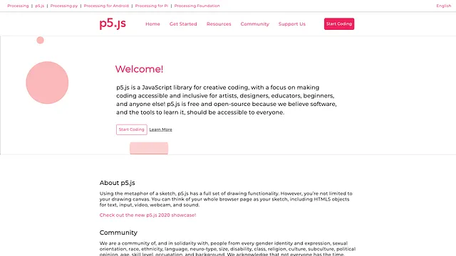

*A screengrab showing Joseph Hong’s new website design for the p5.js website. [image description: A screenshot of Hong’s redesigned p5.js homepage. It features text in black and pink against a white background that says: “Welcome! p5.js is a JavaScript library for creative coding, with a focus on making coding accessible and inclusive for artists, designers, educators, beginners, and anyone else! p5.js is free and open-source because we believe software, and the tools to learn it, should be accessible to everyone. About p5.js: Using the metaphor of a sketch, p5.js has a full set of drawing functionality. However, you’re not limited to your drawing canvas. You can think of your whole browser page as your sketch, including HTMLS objects for text, input, video, webcam, and sound. Community: We are a community of, and in solidarity with, people from every gender identity and expression, sexual orientation, race, ethnicity, language, neuro-type, size, disability, class, religion, culture, subculture, political opinion, age, skill level, occupation, and background.]*

I set out to translate parts of the p5.js website into Korean, as well as to conceive a new navigation structure that could be used for the website’s ‘Learn’ page. I translated the ‘Reference’ section of the p5.js website, standardized the wordings and format for the language JSON file, and created an entirely new website design for the p5.js website.

[Click here for an in-depth article about the project](/web/20251011135635/https://medium.com/processing-foundation/summer-21-translations-coding-and-webdev-oh-my-cc1a2d6bc65f)

[Click here for GitHub (Translations)](https://web.archive.org/web/20251011135635/https://github.com/processing/p5.js-website)

[Click here for GitHub (Prototype Website)](https://web.archive.org/web/20251011135635/https://github.com/jhongover9000/jhongover9000.github.io/tree/main/p5-testSite)

[Click here for prototype p5.js website homepage](https://web.archive.org/web/20251011135635/https://jhongover9000.github.io/p5-testSite/homePage.html)

## Shantanu Kaushik

### Adding to p5.js Friendly Error System

mentored by Thales Grilo and Luis Morales-Navarro (Processing Foundation Fellow 2018)

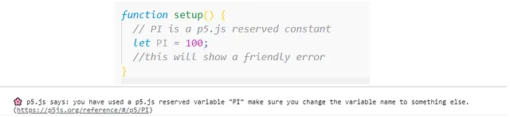

*Screengrab of new features in the p5.js Friendly Error System. [Image description: A block of code that shows the error message: “p5.js says: you have used a p5.js reserved variable “PI” make sure you change the variable name to something else,” followed by a link to the relevant page in the reference library.]*

The major goals of this project were:

### Additions to FES’s fesErrorMonitor

FES’s fesErrorMonitor has a list of errors that it detects. My work was to extend this list, enable fesErrorMonitor to detect more commonly seen errors, and show them in a simplified form.

### Allowing FES to detect redeclaration of p5.js reserved variables and functions

I added a new feature to FES to detect the redeclaration of p5.js’s reserved variables and functions. If a user accidentally redefines a p5.js reserved constant/function, it can cause problems and create confusion.

The new feature sketch_reader.js tackles this problem.

I was able to complete all the goals.

[Click here for GitHub](https://web.archive.org/web/20251011135635/https://gist.github.com/Aloneduckling/c62bb4289fa5bce47e4a78162c3e7975)

## Niki Ito

### Activism Through Storytelling with Code

mentored by Elgin-Skye McLaren (GSOC 2018) and Grace Kwon

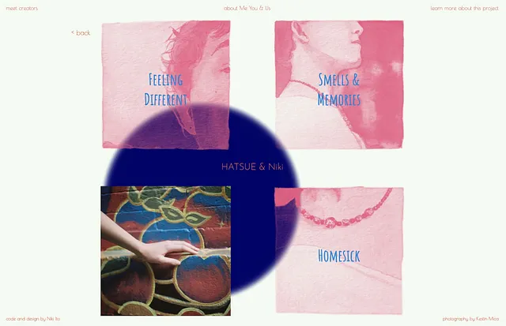

*A screengrab showing the visual narrative website. [Image description: A mosaic of four squares that appear over a white background with a blue circle in the middle. In between the four squares are the words “HATSUE & Niki.” The top left square shows part of someone’s face alongside the words “FEELING DIFFERENT.” The top right square shows half of someone’s face in profile alongside the word “SMELLS & MEMORIES.” The bottom left square shows an image of a hand touching a mural of apples on a wall. The bottom right square shows part of an identifiable image alongside the word “HOMESICK.”*

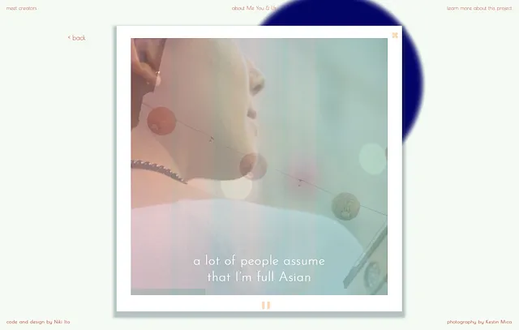

*A screengrab showing the visual narrative website. [Image description: A photograph that appears over a white background with a blue circle in the middle. The photograph, which appears to be a representation of a Polaroid, shows the side of someone’s face and the words “a lot of people assume that I’m full Asian.”]*

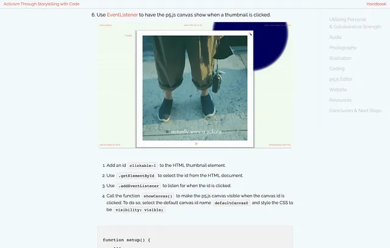

*A screengrab of the project handbook for Activism Through Storytelling with Code. [Image description: A photograph showing someone’s legs and feet and a list of instructions for how to “Use EventListener to have the p5.js canvas show when a thumbnail is clicked.”]*

This project includes a visual narrative website titled “about Me You & Us,” a project handbook, and a GitHub repository. The visual narrative website features intimate stories about members of the Japanese diaspora in the United States. The narratives are told through interactive p5.js sketches with audio, text, and photography. With this website as an example, the project handbook will guide activists, artists, designers, and beginner coders through the conceptual and technical development of the visual narrative website.

[Click here for visual narrative website](https://web.archive.org/web/20251011135635/https://niki-ito.github.io/activism-through-storytelling-with-code/)

[Click here for project handbook](https://web.archive.org/web/20251011135635/https://niki-ito.github.io/activism-through-storytelling-with-code/handbook/index.html)

## Aditya Siddheshwar

### Addon Library Development — p5.teach.js

mentored by Nick McIntyre and Jithin KS (GSOC 2018)

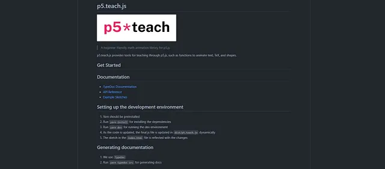

*A screengrab of p5.teach.js addon library. [Image description: A list of instructions in white text on black, with a white box at the top containing black and pink words that say, “p5*teach.” The instructions are broken into four sections: Get Started, Documentation, Setting up the development environment, and Generating documentation.]*

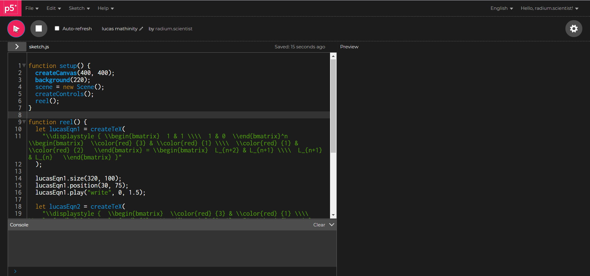

*An animated GIF of p5.teach.js addon library. [Image description: Animated text using p5.teach in p5.js web editor. On the left half of the screen is the p5.js code, and on the right is the rendering of the sketch, containing an animation of matrices being calculated over time.]*

p5.teach is an addon library for teaching math through animations and simulations. It provides educators with tools to make interactive animated sketches that can support learning in the remote environment. p5.teach has a user-friendly API for creating text, TeX, and shape animations. It also includes control buttons for timelines and SVG plotting methods for graphs.

[Click here for work product report](https://web.archive.org/web/20251011135635/https://gist.github.com/two-ticks/4dda385f078abe5ac63cba98eac30e5d)

[Click here for discourse post](https://web.archive.org/web/20251011135635/https://discourse.processing.org/t/animating-maths-in-p5-js/31583)

[Click here for API reference](https://web.archive.org/web/20251011135635/https://github.com/two-ticks/p5.teach.js/blob/GSoC'21/api_reference.md)

GitHub pull requests:

[https://github.com/two-ticks/p5.teach.js/pull/13](https://web.archive.org/web/20251011135635/https://github.com/two-ticks/p5.teach.js/pull/13)

[https://github.com/two-ticks/p5.teach.js/pull/6](https://web.archive.org/web/20251011135635/https://github.com/two-ticks/p5.teach.js/pull/6)

## bug fixing in animations and adding Geometric Objects by two-ticks · Pull Request #20 ·…

### improve GObjects and documentation of methods Add this suggestion to a batch that can be applied as a single commit…

## Stuti Mohgaonkar

### Create p5 Music examples — interactive and generative

mentored by Luisa Pereira (Processing Foundation Fellow 2016)

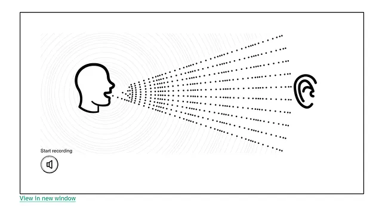

*A screengrab of Create p5 Music, an interactive web version of Luisa Pereira’s book Code of Music. [Image description: A black-on-white illustration showing the profile of a head with sound waves coming out of its mouth and traveling toward an ear.]*

Code of Music* is an interactive book by Luisa Pereira that aims to explain the basics of music theory and eventually to teach people to create their own music with code. I worked with her to make an interactive web and PDF version of the book, along with fellow ITP student Elias Jarzombek, who was also a web developer on the team.

My work included:

### Building an infrastructure that would house the book contents and optimize performance

We chose to use [Magicbook](https://web.archive.org/web/20251011135635/https://github.com/magicbookproject/magicbook) as a platform since it provides a way to create web and PDF versions of the book from the same source files. We began by porting the existing version, which was on Jekyll, to Magicbook. We tested out the libraries that were essential to the project and figured out how they could be bundled with Magicbook. We built a separate plugin for p5.js so that Magicbook could render our interactives as a separate canvas.

### Building an automated workflow that would streamline content creation

Luisa writes all content for the book in notion. This content would have frequent updates. It could have been a time-consuming process to copy and paste the notion content to our repo each time there was an update, so we wanted to automate this. We built our own NodeJS script, which was later converted to a GitHub action to port content written in notion to Magicbook as a markdown file. [The code can be found here](https://web.archive.org/web/20251011135635/https://github.com/43-stuti/notion-github).

### Creating a style guide and generic reusable functions

### Placing the book contents and building the interactives

We used p5js to build all our interactives, which were supported by other libraries like ml5js, tone js, and essentiajs. Our first challenge was to find suitable libraries that would take sound from a reader’s mic and determine parameters like pitch, amplitude etc. Our second challenge was to design the interactions in a fun and user-friendly way. Our third challenge was to make sure the interactions were fluid, so that the idea of visualizing sound was conveyed well.

[The repository for Code Of Music book can be found here](https://web.archive.org/web/20251011135635/https://github.com/luisaph/the-code-of-music)

[Click here for a deployed version of the book](https://web.archive.org/web/20251011135635/https://codeofmusic-16a81.web.app/melodytest/index.html#melody-N25Yfk2)

[Click here to see links to my specific commits](https://web.archive.org/web/20251011135635/https://github.com/luisaph/the-code-of-music/commits?author=43-stuti)

### Future project scope

a. Proposing/contributing to fixes to some of the libraries we are using.

b. Refine our real-time pitch detection logic.

c. Look into integrating screen reader and alt text to the book.

d. Add react-dom to Magicbook.

e. Build out all the remaining interactives.

[Click here for homepage](https://web.archive.org/web/20251011135635/https://codeofmusic-16a81.web.app/melodytest/index.html#melody-N25Yfk2)

[Click here for work report](https://web.archive.org/web/20251011135635/https://thirsty-jobaria-fd1.notion.site/Code-of-Music-GSoC-84ad01fc7bad477cbf1522e3050b458f)

## **Katie Liu**

### Adding Alt Text

mentored by Rachel Lim (GSOC 2019) and Claire Kearney-Volpe (Processing Foundation Fellow 2016, Board of Advisors)

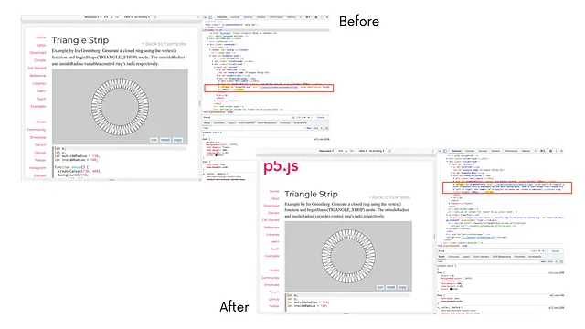

*Screengrabs showing alt-text added to the p5.js website. [Image description: two overlapping screengrabs showing p5.js before and after alt-text was added to the website’s code. Each of the screengrabs is bifurcated down the middle to show the front-end website and back-end code.]*

I worked on improving web accessibility on the p5.js website by implementing alt-text. To begin with, I did a lot of research on best alt-text practices. I read about web accessibility in articles from WebAIM and the Web Content Accessibility Guidelines from W3C. I also familiarized myself with navigating and using the built-in screen reader on my Mac.

In determining what part of the p5.js website I would focus my project on, I explored the p5.js website and its current accessibility. I learned that alt-text had already been added to all of the reference pages, so I decided to focus my efforts on the examples pages.

I spent time writing all of the alt-text for the images, which I would later implement. My mentors Rachel Lim and Claire Kearney-Volpe reviewed, edited, and gave me feedback for these alt-text descriptions. I then added the alt-text via an aria-label attached to the iframe of the image on each of the pages. In total, I wrote and implemented 201 descriptions. This covers all of the examples pages with the exception of the five under the mobile section, because the images do not appear in this section.

I conducted tests on Chrome and Safari using the built-in screen reader on Macs. While the alt-text works fairly well on Chrome, there are issues on Safari. Additional testing using different screen readers as well as browsers would be useful.

I was able to improve the accessibility of the p5.js website for the users of screen readers, which is a very important step in making web content more accessible.

## **Anais Gonzalez**

### Improving the p5.xr Library Through Artistic Examples

mentored by Stalgia Grigg (Processing Foundation p5.js Fellow 2019, Board of Advisors)

![An artist rendering created using code. [Image description: A deep black virtual space in which a planet-like form appears suspended inside a triangle. Abstract oval shapes circulate around the central form.]](images/2021/img-011.jpg)

*An artist rendering created using code. [Image description: A deep black virtual space in which a planet-like form appears suspended inside a triangle. Abstract oval shapes circulate around the central form.]*

p5.xr is a library for p5.js that enables WebXR capabilities with p5 sketches. Our goal for this project was to create a series of examples using the p5.xr library in order to show people how they could work with creative coding concepts inside of virtual spaces. The project was divided into sections (immersive typography, visual art making tools, immersive animation, physics, and embodiment), and each section was broken down into basic and complex examples.

In order to share what I learned about XR with others, I included commentary that explained how to use XR-specific functions within the basic examples. I then expanded upon these same concepts within the complex examples to show that advanced artistic exploration within virtual reality is possible too.

## **Masood Kamandy**

### Advancing SwiftProcessing with Learners in Mind

mentored by Jon Kaufman

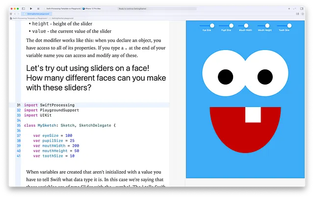

*A screengrab of a chapter from the SwiftProcessing Playground textbook that is now included with the framework. [image description: A screenshot of the online textbook. On the left side is black text on a white background that shows code and instructions for using sliders to create an illustration of a face. On the right side of the image is an illustration of a smiley face, made with geometric shapes. At the top of the image are several sliders, for eye size, pupil size, mouth width, mouth height, and tooth size.]*

My proposal for Google Summer of Code was to use my teaching experience to improve the reliability and user experience of the SwiftProcessing framework, as well as build out a series of examples for new learners. These ideas culminated in the creation of a 25 “chapter” literate programming textbook made using Xcode Playgrounds. The textbook formed the backbone of our process. Explanatory text was written before the SwiftProcessing library was modified. The example code was then written in Processing.

When we translated that code into Swift, we immediately saw where the current library was failing to live up to Processing user expectations, so we modified the codebase by fixing existing code or adding new code. This involved a delicate balance of leveraging the Swift language and not deviating too far from the Processing paradigm.

The idea for this process was to use a first quarter or semester course in SwiftProcessing as the baseline for what should work within the library. The library also receives the benefits of the Xcode IDE, as almost every method and property within the framework is documented to make Xcode Quick Help available within the editor.

The end result is a brand new Playground textbook, many new examples, and a framework that is far better documented, more stable, and feature rich.

## **Satya Sai Bhushan Tambabathula**

### Improve Test Coverage in p5.Sound library

mentored by Guillermo Montecinos

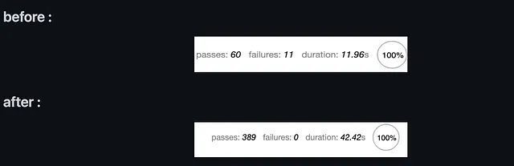

*Screen-captured test results for the p5.js sound library. [Image description: Two parallel white boxes against a black background. Each box shows the results of a series of tests. The top box reads, “passes: 60; failures: 11; duration: 11.96s,” with “100%” appearing in a circle. The bottom box reads, “passes: 389; failures: 0; duration: 42.42s,” with “100%” appearing in a circle.]*

The aim of this project was to improve the testing architecture and the test coverage of the p5.js sound library. I added new unit tests and introduced headless testing to the library, which can be used in GitHub actions in the future. I also wrote a wiki page about the testing architecture and about how to write tests for beginners. I added more than 300 unit tests to the project and increased the test coverage 5-fold, which you can see in the picture provided.

## **Sanjay Singh Rajpoot**

### Internationalization(i18n) and Deployment of p5.js Website

mentored by Aditya Rana

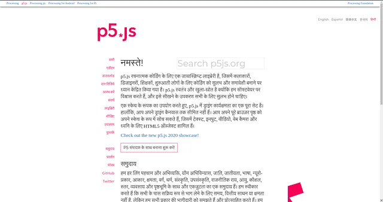

*A screengrab showing the p5.js website in Hindi translation. [Image description: A white webpage with “p5*js” in bold pink at the top of the page. Underneath it, there are two columns of Hindi text, one narrow column in pink on the left, and one wider column in black on the right.]*

For this project, I added a new Hindi translation feature to the p5.js website. Due to internationalization (i18n), the p5.js website is built from templates that retrieve the text content from data files. The entire site is built with Node JS, Handlebars, and Grunt. There are three kinds of pages — References, Examples, and other web pages — and each works differently. References pages are built in English and swapped to other languages using JS on the front end. Translation content is stored in a JSON object. For every new page, we needed to create a key-value pair in the hi.yml file. A single JS template was also needed. Examples pages are built from templates with Handlebars, while examples are stored in JS files. To implement i18n, new templates were created specifically for the Hindi language, so that Examples were rendered properly. Other pages are built from templates in which Handlebars point to the content in the actual language when rendered.

---

*Originally published on [Medium](https://medium.com/processing-foundation/wrap-up-post-of-all-2021-google-summer-of-code-projects-d3bcb8713ebb). Archived 2026-03-09.*
