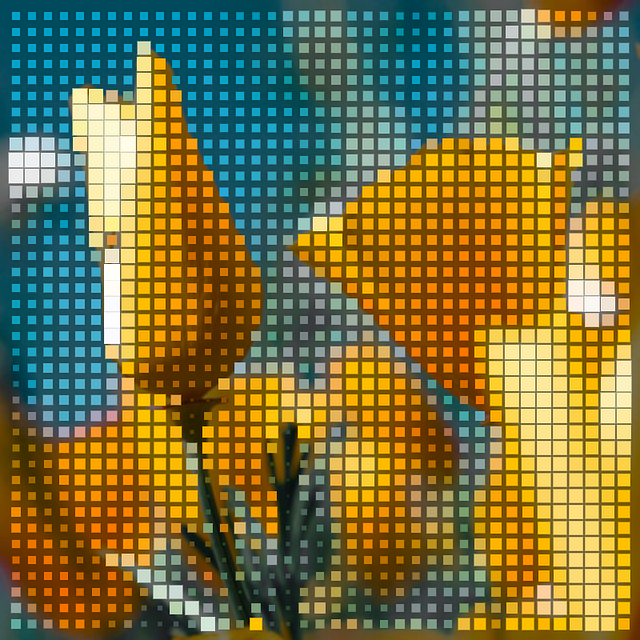
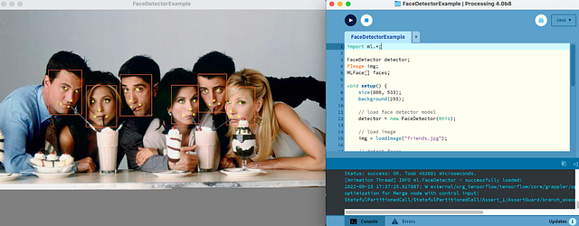
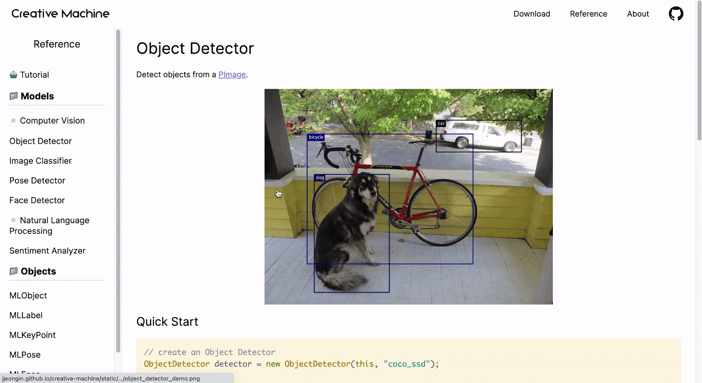

# Google Summer of Code 2022 Wrap-Up Post

This summer marks Processing Foundation’s eleventh year participating in ***[Google Summer of Code](https://web.archive.org/web/20221217215147/https://summerofcode.withgoogle.com/)*! The GSoC program aims to get new contributors involved in open-source software by providing a stipend to work on a project of their choice. We received 52 proposals and eight were accepted into the GSoC program. Beyond those, we identified three projects that we are supporting directly. Keep reading to learn about the contributors, projects, and mentors. You can find the announcement post from [July 2022 here](/web/20221217215147/https://medium.com/processing-foundation/announcing-google-summer-of-code-2022-projects-and-a-few-more-77043ab4d0b4)*.*

Edited by [Saber Khan](https://web.archive.org/web/20221217215147/https://www.edsaber.info/) and [Suhyun Choi](https://web.archive.org/web/20221217215147/https://www.suhyunchoi.net/)

*A collaged picture of all 11 contributors’ headshots for this year’s GSoC.*

## [Malay Vasa](https://web.archive.org/web/20221217215147/https://www.malayvasa.com/) — p5.js Examples Code Improvement

Mentored by [Tyler Yin](https://web.archive.org/web/20221217215147/https://tyleryin.co/)

Currently finishing this project as part of an extended timeline which ends in November 2022.

**Project Description**

Malay is working with his mentor Tyler on updating the examples in the p5 website to contextualize them with principles of visual design. By showcasing how the tools can be used visually, he aims to bridge the gap that beginners often face between conceptualizing an artwork and coding it. He also plans to improve the user experience of the examples page by introducing search and thumbnails.

**Project Update**

In this project, I aimed to develop a new set of examples for the p5.js website that introduce examples which focus on programming constructs alongside concepts of art & design. As I had planned in the beginning of the project, I have been able to work on the examples in 5 of the 25+ categories present on the website. These include: Color, Math, Image, Motion, Drawing, and Input. So far, I am on track to proposing 50+ examples, some of them are reworked versions of current examples and some are completely new. I have also worked on wireframing a set of improvements to the layout of the examples page but have not been able to implement in the code yet. I have opted for an extended timeline as I hope to continue adding more examples!

*Image Pixel Array Manipulation*

*Circular Motion*

*Monochromatic Color Scheme*

**Biography**

Malay Vasa is a third-year undergraduate student of Human Centered Design at Srishti Manipal Institute in Bangalore. He is also a self-taught front-end developer and creative coding enthusiast. He has been a part of the Processing community since one of his first-year projects was featured in the [p5.js 2020 showcase](https://web.archive.org/web/20221217215147/https://connie-liu.me/p5.js-showcase/#/2020-All/project-15/). This is his first time participating in Google Summer of Code.

## [Austin Slominski](https://web.archive.org/web/20221217215147/https://www.aceslowman.com/) — Resolving Bugs and Expanding Documentation for WebGL in p5.js

Mentored by [Kate Hollenbach](https://web.archive.org/web/20221217215147/http://www.katehollenbach.com/), Processing Foundation Board member

Currently finishing this project as part of an extended timeline.

**Links**

- [Work Product Report (Gist)](https://web.archive.org/web/20221217215147/https://gist.github.com/aceslowman/3d18e8e3acac994bde2ae2512cc85f3d)

Austin Slominski worked with mentor Kate Hollenbach to expand on the documentation for the WebGL functionality in p5.js, as well as miscellaneous minor fixes as they were encountered. Austin built a number of new Learn page tutorials meant to introduce coders to the basic concepts and techniques relevant to WebGL, including 3D setup, coordinates, transformations, materials, lighting, custom geometry, as well as an introduction to shader programming. Each of these documents also contain a number of examples and external resources that give users more opportunities to learn.

My project was focused on identifying some of the ways that the WebGL documentation for p5.js can be expanded on and improved. I began by adding describe() text to improve accessibility for WebGL functionality in the example and reference sections, and then I began expanding on and fixing issues with some existing examples.

The largest part of this project has been the creation of four new WebGL tutorials for WebGL, each including illustrations, interactive examples, and text. These tutorials are titled: “Getting Started in 3D”, “Creating Custom Geometry”, “Styling and Appearance”, and “Introduction to Shaders”.

In the future I would like to see the WebGL examples and documentation on the p5.js website continue to grow, along with translations of the tutorials into other languages. As the Learn page continues to grow it would also be great to see more processes develop to create more interactive examples.

What I learned about open source is that things that seem simple can be a complex combination of what the community needs. The tools that are used in projects like p5.js to maintain and organize contributions aren’t often seen from the outside but reflect the effort of many people thinking through how an open and inclusive community can be continually improved. I’m glad that I’ve had this opportunity to get more experience with the process of contributing to open source so that I can contribute further to p5.js and other projects in the future.

Austin Slominski is an audiovisual artist based in Denver, CO, originally from Missoula, MT. His work uses custom software to create sounds and visuals that explore ideas around how we interact and navigate with others within networks through multimedia work, performance, installation, and web art. Austin recently received his MFA from University of Denver’s Emergent Digital Practices program, where his thesis focus is on building networked tools for artists and other creative tools. [Instagram](https://web.archive.org/web/20221217215147/http://instagram.com/aceslowman) [Github](https://web.archive.org/web/20221217215147/https://github.com/aceslowman) [Twitter](https://web.archive.org/web/20221217215147/http://twitter.com/aceslowman)

## [Gracia Zhang](https://web.archive.org/web/20221217215147/https://www.gracia-zhang.design/) — p5.js Teach Page

Mentored by [Inhwa Yeom](https://web.archive.org/web/20221217215147/https://yinhwa.art/), past Processing Foundation Fellow

Gracia planned to re-organize media from the teachers, code, and video files. She reorganized the resources with more detailed tags, renew unreachable links, and update the materials. She also updated the contents, link to associated resource content, and try to grade contents by difficulty.

In this project, Gracia updated the posts based on the recent submission form first to be familiar with the original /Teach and to research the users through the submitted forms. Based on user studies, she intends to bring more learners & diversity on the /teach page by optimizing the submission form with a new form for learners who want to share, and a new section “Upcoming Workshops”. Inhwa and Gracia hope that this new section will bring in more willing learners and give more teachers the opportunity to share their workshops, classes, etc.

[github link](https://web.archive.org/web/20221217215147/https://github.com/processing/p5.js/blob/main/contributor_docs/project_wrapups/graciazhang_gsoc_2022.md)

**Demo gif:**

Gracia is a visual designer and a front-end development beginner. She majors in ITP in NYU as a first-year master.

## [Shubham Kumar Sharma](https://web.archive.org/web/20221217215147/https://github.com/ShenpaiSharma) — Improving p5.js WebGL Functionality

Mentored by [Caleb Foss](https://web.archive.org/web/20221217215147/https://www.calebfoss.com/)

- [Wrap-up post](https://web.archive.org/web/20221217215147/https://github.com/ShenpaiSharma/GSoC-2022-Wrap-Up)
- [Multiple material PR](https://web.archive.org/web/20221217215147/https://github.com/processing/p5.js/pull/5774)
- [Rounded rect PR](https://web.archive.org/web/20221217215147/https://github.com/processing/p5.js/pull/5789)

This project aims to implement some new features and enhance the current functionalities for p5.js and refactor the WebGL rendering pipeline so that multiple materials can be applied to geometry.

The main purpose of this was to work on refactoring of WebGL rendering pipeline so that multiple features can be applied to geometry, and now users can use this new feature to give a new exciting look to their sketches and art. We have decided to move away from the current overwriting of fill colors to the geometry towards the approach that Processing uses, where the material has different color properties (ambient, emissive, and specular) that all contribute separately to the lighting of the surface. Also, we worked on adding a missing feature rectangle in WebGL mode i.e, corner radius is not accepted. Now users can also use this feature of rect() in WebGL mode. We took the approach that Processing follows to implement rounded corners of a rectangle, i.e. using immediate mode; thus, we implemented it using vertex and quadraticVertex(). It was finally a great learning experience, contributing to such an exciting project, and I will be very happy to see when users take full advantage of these new features to give their art a new and exciting look.

*Two sketch images containing two spheres, with red ambientMaterial and black specularMaterial and on the other sphere red ambientMaterial and white specularMaterial with white specularLight on both sketches.*

Shubham Kumar is a final-year undergraduate student from IIT Dhanbad. He is originally from India and loves experimenting with new technologies and learning from them. He discovered creative coding while contributing to the Processing Foundation and has enjoyed it. This is his first time participating in GSoC and he is currently exploring the world of open source. He hopes to learn a lot and enjoy this experience!

## [Jeongin Lee](https://web.archive.org/web/20221217215147/https://www.linkedin.com/in/jeongin-lee-4687401b3/) — Beginner-friendly ML Library for Processing

Mentored by Andrés Colubri

- [Creative Machine GitHub](https://web.archive.org/web/20221217215147/https://github.com/jjeongin/creative-machine)
- [Creative Machine Website](https://web.archive.org/web/20221217215147/https://jjeongin.github.io/creative-machine)

*Creative Machine Face Detection demo in Processing. The software is detecting an image of a cast of ‘Friends’ to the left, where red boxes detect their face and yellow dots mark their eyes, nose, and ends of lips.*

*Creative Machine Face Detection demo in Processing. The software is detecting an image of the ​​the world’s largest selfie taken in Bangladesh with at least 1,151 people in it.*

*Creative Machine Website demo gif.*

Creative Machine is a Machine Learning library for Processing. The library was implemented on top of [Deep Java Library (DJL)](https://web.archive.org/web/20221217215147/https://djl.ai/) and currently supports five machine learning models: object detector, image classifier, pose detector, face detector, and sentiment analyzer. The models can run predictions on an image or video in a Processing application. The [library website](https://web.archive.org/web/20221217215147/https://jjeongin.github.io/creative-machine) offers documentation of each model with example codes.

In this project, I aimed to develop a new Machine Learning library for Processing that is easy to use for beginners. As I initially planned in my proposal, I was able to create and release the library and its documentation website. It was my first time contributing to open source software and I learned so much, especially on how to develop a library from scratch and use machine learning models in code. For the future of Creative Machine, I am planning to add more models and examples in the library, as well as improving the website UI. I hope this project will be helpful for beginners to play with Machine Learning in Processing!

Jeongin Lee is a junior at New York University Abu Dhabi, studying Computer Science with a minor in Interactive Media and Mathematics. She is interested in Artificial Intelligence and Interactive Art, exploring the intersection of technology and art. Outside of school work, she loves making art with code, watching films, visiting museums, and traveling. [GitHub](https://web.archive.org/web/20221217215147/https://github.com/jjeongin) [Instagram](https://web.archive.org/web/20221217215147/https://www.instagram.com/jeong.in.work/)

## [Samir Ghosh](https://web.archive.org/web/20221217215147/https://samir.tech/) — p5.xr Immersive Session and Controller API update

Mentored by Stalgia Grigg

- [Work Summary](https://web.archive.org/web/20221217215147/https://github.com/smrghsh/GSOC22)
- [Pull Requests and Issues](https://web.archive.org/web/20221217215147/https://github.com/stalgiag/p5.xr/issues?q=author%3Asmrghsh)

Samir is bringing improvements to p5.xr in order to expand p5.js’s capabilities in creating 3D VR experiences for devices such as Meta Quest 2 and Valve Index. Some proposed improvements include controller interfaces and representation, locomotion, and object interaction.

p5.xr allows a user to open 3D p5 sketches inside a VR device using the [WebXR device API](https://web.archive.org/web/20221217215147/https://immersiveweb.dev/). My main accomplishment of this summer was an improvement to the process by which p5.xr launches an immersive session– it now renders a preview of the scene to the user to show what the full immersive session could look like. As the VR applications are tending towards norms in interfaces– there is still a lot of work to be done in making it easier for p5 users to implement interfaces such as menus. As I intend to teach with p5.js at UC Santa Cruz, I hope to continue my contributions while being informed by students’ experience. This was my first time contributing to open source, and Stalgia taught me many Git practices and development techniques that profoundly impacted the way I write software and collaborate with others. Best practices in WebXR development are still being negotiated, so this mentorship has been an invaluable way for me to learn how to use the WebXR API at a lower level. This standard, as well as the types of devices that people use are rapidly changing; I got a unique glimpse at how this library was created for web-based AR and VR-cardboard that are now seldom used. As Head-mounted display VR devices are coalescing around the same design and adoption increases, it is my hope that p5.xr removes barriers in VR development as p5.js removes barriers for me and many others with creative code.

Samir Ghosh is a VR developer and educator based in Santa Cruz, California. They are currently pursuing a PhD in Computational Media and researching multi-user VR software in the SET Lab at UC Santa Cruz. Previously, they served as the Assistant Director of the Ahmanson Lab, a library makerspace at USC that produces AR and VR projects in the humanities. In their free time, Samir shares creative code and curates memes. [Homepage](https://web.archive.org/web/20221217215147/https://samir.tech/) [Github](https://web.archive.org/web/20221217215147/https://github.com/smrghsh) [Instagram](https://web.archive.org/web/20221217215147/https://www.instagram.com/vertex.shader/)

## Annie Zheng — BONDS: Improving the p5.js Showcase’s Accessibility to Expand Community Support For New Coders

Mentored by [Rachel Lim](https://web.archive.org/web/20221217215147/https://www.linkedin.com/in/rachel-lim-324a8ab6), past GSoC contributor and new p5.js Web Editor Lead

- [Github](https://web.archive.org/web/20221217215147/https://github.com/processing/p5.js-showcase)
- [Working project link (Open Call post)](https://web.archive.org/web/20221217215147/https://www.instagram.com/p/CgQAi4IvzH5/)

Annie Zheng is working on the fourth iteration of the p5.js showcase. She will be exploring the theme of “BONDS”, which will emphasize community building and extending support to new coders. This showcase will specifically focus on exploring accessibility in non-violent, caring, and creative ways. It will begin preparations for the showcase launch through various social media channels.

At the moment, the p5.js showcase is not yet finished but so far, we have finished the Open Call process, collected the responses, and created the wireframes for the updated showcase page. I am currently still in the process of coding the actual site and it will be done soon! As the showcase is reiterated annually by a different GSoC contributor, I would love to see future contributors also create their own take on the showcase by changing the layout, the graphic elements, and considering new ways to showcase the works. For example, this year, we are adding a page highlighting the contributors in a yearbook photo style, so I would love to see the different creative ideas future contributors have. As the codebase is extremely extensive since it was compiled from three years of past showcases, I learned a lot about the tedious and dedicated organization of code in an open source community, like the Processing Foundation, in order to maintain the libraries and to continue improving user experience. Overall, I’ve been really enjoying this opportunity so far and I look forward to sharing the 2022 p5.js showcase with everyone!

Annie Zheng is a junior at the University of Southern California pursuing a major in Media Arts + Practice (BA) from the School of Cinematic Arts. She became interested in creative code after taking a class at USC, and since then she strives to use code and other media platforms to create new narrative experiences. In her spare time, she enjoys eating her way across LA and shamelessly trying to teach herself to dance (unsuccessfully).

## [Jesús Rascón](https://web.archive.org/web/20221217215147/https://twitter.com/jesi_rgb) — Saving GIF files in p5.js

Mentored by [Divyanshu Raj](https://web.archive.org/web/20221217215147/https://in.linkedin.com/in/divyanshu-raj-899514186), past GSoC contributor

- Article: [GIF encoding in p5.js](https://web.archive.org/web/20221217215147/https://www.jesirgb.com/blog/gif-encoding)
- Github PR: [Implement saveGif as a native p5 function #5709](https://web.archive.org/web/20221217215147/https://github.com/processing/p5.js/pull/5709)

Our main goal is to add functionality to the p5.js library to be able to save GIF files quickly and easily. GIF file saving is currently an aspect that many artists struggle with. It’s one of the easiest formats to publish to social media, especially Twitter. That said, generating a GIF out of a given animation is not particularly straight forward. We are aiming to solve this problem, among other bug fixes that may come with or be related to it.

We achieved a long due feature in p5.js: GIF saving! The saveGif function is now publicly available for everyone to use and allows us to quickly download a GIF from the animation. Right now, even though it works, it can (and surely will) improve with much more options and robustness. We can say it’s in a beta state. I’d love for people to use this tool to speed up their working/sharing process, especially on Twitter. Professionals will likely rely on other tools when releasing the work, but I think this is a great way to make it easier to share WIPs (works in progress) faster than ever. In this project, I learned a lot of Javascript, algorithms, how to optimize for production, and how to set up the CI tools to work well together. Overall, an incredible experience. Would very much repeat!

Jesús is a Spanish computer and data scientist, and video producer. He’s been creating things since he was very young and continues to do so. He’s worked with Youtube channels such as Veritasium and Reducible as a mathematical animator, and aims to become a Computer Science educator and animator. He is also a musician and producer, with one album published on all major platforms. He’s also an amateur graphic designer, with several infographics, posters, and a YouTube channel rebranding.

Processing Foundation is directly supporting the following projects submitted via GSoC.

## [Tushar Gupta](https://web.archive.org/web/20221217215147/https://www.linkedin.com/in/tushar55/) — Add Skia as a 2D renderer in p5.py

Mentored by [Ziyao Zhang (Mark)](https://web.archive.org/web/20221217215147/https://www.linkedin.com/in/ziyaointl/), past GSoC contributor

- [Medium Article](/web/20221217215147/https://medium.com/@codingid6/implementing-a-2d-backend-renderer-using-skia-for-p5py-c20ae2dfdf7b)
- [GitHub Work Product Report](https://web.archive.org/web/20221217215147/https://github.com/p5py/p5/blob/master/project-wrapups/summer-fellow-2022-wrapup/tushar-processing-summer-fellow-2022-product-work-report.md)

**GitHub Links**

- [Setting up Environment APIs for Skia](https://web.archive.org/web/20221217215147/https://github.com/p5py/p5/pull/344)
- [Enhancing Skia Further](https://web.archive.org/web/20221217215147/https://github.com/p5py/p5/pull/357)
- [Implementing Image APIs](https://web.archive.org/web/20221217215147/https://github.com/p5py/p5/issues/379)
- [Adding Typography support for Skia](https://web.archive.org/web/20221217215147/https://github.com/p5py/p5/issues/371)
- [Support for offscreen buffers in Skia](https://web.archive.org/web/20221217215147/https://github.com/p5py/p5/issues/386)
- [All other minor Pull Requests that fixed other minor stuff](https://web.archive.org/web/20221217215147/https://github.com/p5py/p5/pulls?q=is%3Apr+is%3Aclosed+author%3Atushar5526)

Tushar is setting up Skia as a 2D backend renderer in p5.py, the native python port of Processing. It would give a significant performance boost and enhance the typography support of p5.py. Tushar is mentored by Ziyao Zhang (Mark), who was a student in GSoC 2020 and worked on enhancing p5.py.

The decision to use Skia as our 2D renderer turned out to be very fruitful. We have better efficiency and quality for 2D sketches. The task was huge as it involved refactoring the library to make it support different renderers and also with Skia providing support for additional APIs that were not present before in vispy backed sketches. We also have a better CI in place.

I have written an in depth [article](/web/20221217215147/https://medium.com/@codingid6/implementing-a-2d-backend-renderer-using-skia-for-p5py-c20ae2dfdf7b) about the same as well.

Skia is very powerful and currently we are looking to support all the missing APIs that were not present in p5.py earlier. Along with it, we need the community to try our new renderer and report bugs. There are many other good first issues labeled on the repository that new contributors can start with.

The whole journey to getting selected as a fellow in Processing has been a rollercoaster and full of learnings. I love the open source community and the humble people involved in it. I also got a chance to interact with other GSoCers and Fellows in gather.towns. A major reason why FOSS is so booming is due to the community and equally talented and humble people involved, which makes it fun to be a part of it.

*On the left is a sketch rendered using Skia and on the right is a sketch rendered using vispy with the same settings. There are significant improvements in both efficiency and quality of the sketches. The left sketch loads the image of colorful circles bouncing up and down on the screen.*

Tushar is a pre-final year student from the KIET Group of Institutions, India, majoring in Computer Science. He has an avid passion for software development and started his open-source journey with Processing a few years back. He loves Python and making hacks that help him automate the boring stuff. Fun-Fact: You can find him enjoying free coffees at Hackathons or gazing at computer simulations.

## [Zelle Marcovicci](https://web.archive.org/web/20221217215147/https://zelle.zone/) — Writing py5 tutorials and how-to documentation to support creative coders new to Python and/or new to the Processing ecosystem

Mentored by [Tristan Bunn](https://web.archive.org/web/20221217215147/https://tabreturn.com/) and [Jim Schmitz](https://web.archive.org/web/20221217215147/https://ixora.io/)

- [Zelle’s Work Product Report](https://web.archive.org/web/20221217215147/https://github.com/marcovicci/py5book/blob/main/developer/zellemarcovicci_GSOC_2022.ipynb)
- [Zelle’s py5 tutorials Github branch](https://web.archive.org/web/20221217215147/https://github.com/py5coding/py5book/pull/41)

[Zelle](https://web.archive.org/web/20221217215147/https://www.linkedin.com/in/denzelle/)

 is teaching an introductory course (Intro to Programming for Interactive Projects) that has always revolved around the use of Processing’s Python mode, but updating it to use py5 in the Thonny IDE. In the process of adapting the course to these standards, she has also been producing documentation to contribute to the [http://py5.ixora.io/](https://web.archive.org/web/20221217215147/http://py5.ixora.io/) site, allowing anyone to follow basic tutorials around visual output in coding, interactivity in py5, and more!

This project was not just to adapt, write, and rewrite some documentation, but to utilize it in teaching and to see what organically developed in the work of her students. In this way py5 has been an enormous success, and the 100-level students using it to learn visual coding have responded incredibly well. The most wonderful part about contributing to open source projects like this is seeing your contributions make some kind of impact, and the response even from within the small py5 community has been very heartening. Thanks to frequent communication and support from both of her mentors, everything has gone smoothly and Zelle is hoping to continue contributing tutorials and snippets of interesting code to the py5 documentation site even after GSoC 2022 has wrapped up.

*The py5 tutorial for Mouse and Keyboard Interaction walks you through producing a simple drawing app.*

Residing in Wellington, New Zealand, [Zelle](https://web.archive.org/web/20221217215147/https://twitter.com/tenderhooves) (pronounced like the first syllable of Zelda) is a developer, anarchist, foodie, gamer, bleeding-heart nature lover, metalhead, and stuffed animal collector. She’s clearly lost, but having fun. When she’s not tutoring (and studying) at [Massey University](https://web.archive.org/web/20221217215147/http://massey.ac.nz/), she is enmeshed in virtual worlds, staring at the ceiling trying to figure out how to bugfix real life, or feeding her Neopets that are older than most of her students.

## [Rupesh Kumar](https://web.archive.org/web/20221217215147/https://www.instagram.com/withrupesh/) — Finalizing the Update of the Android Mode to Processing 4

Mentored by [Aditya Rana](https://web.archive.org/web/20221217215147/https://in.linkedin.com/in/adityarananitt), past contributor and mentor

All my contributions during the mentorship program can be found [here](https://web.archive.org/web/20221217215147/https://github.com/processing/processing-android/pulls?q=is%3Apr+author%3Arupeshkumar22).

Some initial progress has been made in getting the Android mode to work with current betas of Processing 4. Rupesh is working on the Android mode to make it fully compatible with the final version of Processing 4 and the most recent releases of the Android platform.

The goal was to accomplish four major tasks to make Android Mode fully compatible with current betas of Processing 4. Out of these four tasks, two tasks(Fully functional Emulator and Debugger) have been completed. The two pending tasks (SDKUpdator Improvements and Maven Publish Automation) are planned to be completed within the extended timeline.

After the completion of the program, Android Mode will be more stable in terms of its existing functionalities. Looking at the discussions on the organization’s [discourse platform](https://web.archive.org/web/20221217215147/https://discourse.processing.org/), I believe there are endless opportunities and ideas to provide some new useful features in support of existing functionalities. Customization of Emulator, Additional options for Keystore Management, Website Tutorials Update, etc. are the names of the few demands from our user base.

Because we can access the technology and working knowledge of the open source projects, it helps to exchange ideas and grow together. I learned that open source is more about collaboration than competition.

*Left Image: Shows the Debugger options with Variable Inspector (Fixed with PR #710 and PR #711). Right Image: Working Emulator after the necessary package installations with ‘Run In Emulator’ option (Fixed with PR #706 and PR #709).*

Rupesh holds a degree in Computer Science and Engineering. He has been actively contributing to Processing for Android. Some of his previous work involves AndroidX Migration of core library and incorporation of AAB(Android App Bundle) support to Android Mode. Rupesh holds a degree in Computer Science and Engineering. He has been actively contributing to Processing for Android. Some of his previous work involves AndroidX Migration of core library and incorporation of AAB(Android App Bundle) support to Android Mode.

---

*Originally published on [Medium](https://medium.com/@ProcessingOrg/google-summer-of-code-2022-wrap-up-post-cb64caa840f0). Archived 2026-03-09.*
