# Google Summer of Code 2023 Wrap-ups!

*A graphic of all 8 contributors’ headshots for this year’s GSoC.*

This summer, the Processing Foundation celebrates its twelfth year of participation in Google Summer of Code (GSoC)! The primary goal of the GSoC program is to engage fresh talent in the realm of open-source software development. Out of a pool of 91 submissions, 8 outstanding proposals have been chosen in the GSoC program. Continue reading to discover more about the dedicated contributors, compelling projects, and the mentors involved. For additional details, check out the ***[official announcement post from June 2023](/web/20240812042327/https://medium.com/@ProcessingOrg/announcing-google-summer-of-code-2023-projects-75080c1554aa)*.*

Edited by Suhyun Choi and Raphaël de Courville

## [Justin Wong](https://web.archive.org/web/20240812042327/https://wonger.dev/)— Supporting shader-based filters in p5.js

Mentored by **[Adam Ferriss](https://web.archive.org/web/20240812042327/https://amf.fyi/)**, **[Austin Slominski](https://web.archive.org/web/20240812042327/https://www.instagram.com/aceslowman/)**, and **[So Sun Park](https://web.archive.org/web/20240812042327/https://www.instagram.com/sosunnyproject/)**

**Current Status:** Complete

**Project Description**

Justin’s work on p5.js centered around the filter() function because it was too slow and because it wasn’t supported outside of P2D mode. He made it faster by using shaders, which are programs that use the GPU for image processing. Now people can use effects like blur in any mode without noticing such a drop in performance.

There were some secondary accomplishments as well. There’s a new function createFilterShader() that makes writing shaders easier. He helped revise a few documentation pages. He also tried to contribute some benchmarking tools, but that was a bit ambitious.

**Project Update**

1. There should be some refactoring to cut down on all the graphic layers — maybe by using framebuffers, or maybe just by understanding and wrangling the canvases better.
2. There’s some alternative blur filters being investigated.
3. Mobile performance needs attention too.

*A comparison of blur filters, before and after.*

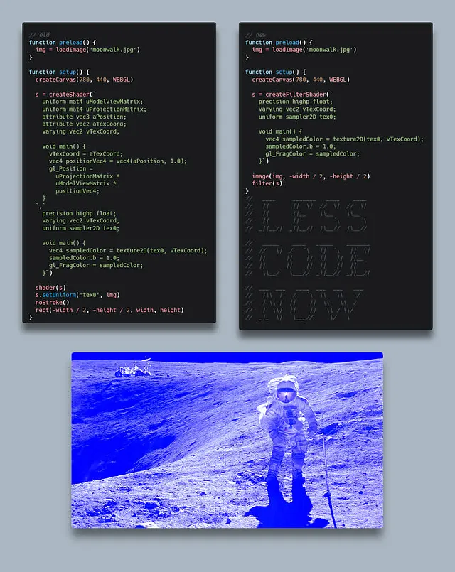

*A comparison of 2D shader code, before and after.*

**Biography**

Justin Wong is a programmer from Central Florida. He thinks a lot about designing applications, building happy little web projects, mastering command-line tools, and communicating effectively. He plays sports and does volunteer work in his free time.

**Links**

- [Work Product Report](https://web.archive.org/web/20240812042327/https://wonger.dev/posts/p5js-shader-filters)

## [Will Rabalais](https://web.archive.org/web/20240812042327/https://www.linkedin.com/in/will-rabalais-28b005216/)— Friendlier Error Messages for Processing

Mentored by **[Sam Pottinger](https://web.archive.org/web/20240812042327/https://gleap.org/)** and **[Raphaël de Courville](https://web.archive.org/web/20240812042327/https://twitter.com/sableraph)**

**Current Status:** Completed

They began a revamp of the existing Processing error message system so that it is more user friendly and descriptive. Taking inspiration from the [p5.js Friendly Error System (FES)](https://web.archive.org/web/20240812042327/https://github.com/processing/p5.js/blob/main/contributor_docs/friendly_error_system.md), their focus was to replace the pre-existing error messages that were often vague and not easily understood by beginners. They wanted to offer beginners an option to receive longer messages with more context but also not force unwanted explanations of beginner concepts on advanced users.

They simplified the error messages by breaking them down into digestible components while retaining the necessary technical information. They also added a button that appears next to an error message if there is an expanded version of it that creates a popup with a longer explanation and links to external resources. Many new error messages were written and there is now a framework in place for future contributors to add new ones. The error messages are now more descriptive, helpful and beginner friendly!

*Code Generating an Error*

*Popup window which appears once the more information button is clicked*

Will Rabalais is a sophomore studying computer science and mathematics at the University of Maryland at College Park. Will has experience with technical writing, Java development, and object oriented programming. His interest in Processing stems from its emphasis on accessibility to beginners and the creativity it facilitates. He enjoys watching movies, reading, and traveling and has lived in four different countries but calls Amsterdam home.

- [Work Product Report](https://web.archive.org/web/20240812042327/https://github.com/processing/processing4/pull/771#issuecomment-1695917774)
- Github Repository: [Processing](https://web.archive.org/web/20240812042327/https://github.com/processing/processing4/tree/main)
- Additional Resources: [Full pull request](https://web.archive.org/web/20240812042327/https://github.com/processing/processing4/pull/771)
- Social media: [Linkedin](https://web.archive.org/web/20240812042327/https://www.linkedin.com/in/will-rabalais-28b005216/)

## [Kathryn Lichlyter](https://web.archive.org/web/20240812042327/https://www.linkedin.com/in/kathryn-lichlyter-664751189/) — Updating p5js.org Site Documentation and Accessibility

Mentored by **[Caleb Foss](https://web.archive.org/web/20240812042327/https://github.com/calebfoss)** and **[Paula Isabel Signo](https://web.archive.org/web/20240812042327/https://www.biodrop.io/paulaxisabel)**, advised by **[Claire Kearney-Volpe](https://web.archive.org/web/20240812042327/https://takinglifeseriously.com/index.html)**

**Current Status:** Some PRs pending merges.

This summer, Kathryn assisted the Processing Foundation with the navigational and visual accessibility of their [p5.js documentation site](https://web.archive.org/web/20240812042327/https://p5js.org/) by conducting an accessibility audit to gauge the current deficits of the platform, prioritizing what changes and/or additions need to be made to improve accessibility, inclusion, and usability, and seeing those changes through by re-coding and/or re-designing the appropriate aspects of the site. They also contributed a new [learn guide](https://web.archive.org/web/20240812042327/https://p5js.org/learn/) for their ARIA labeling functions to assist with screen reader accessibility.

They completed the accessibility audit, which focused on addressing the visual (img 1 example), navigational (img 2 example), and accessibility issues on the p5.js documentation site.

They submitted revisions for the prioritized accessibility issues found during the audit below, with some of them still pending approval and revision:

After completing the accessibility audit and submitting their code revisions, they wrote a tutorial that would help the p5.js community make their written code more accessible and accommodating for screen readers and other assistive technologies.

The overall objectives of this tutorial were to:

1. Make people aware of these new features
2. Let people know how to use them
3. Indicate the best practices for ARIA labeling, from very simple to very complex and dynamic canvases. There could also be a section about proper alternative text for highly-interactive and highly-animated sketches and how to best use describeElement() to explain the sketch’s changes.

At this moment, this tutorial is still going through the process of revision, from both the p5.js lead team and Processing Foundation community.

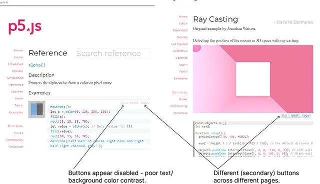

*Annotated screenshots of p5js.org’s inconsistent secondary button design.*

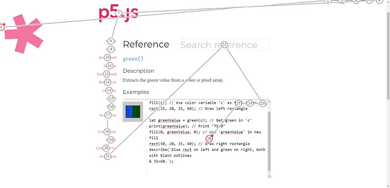

*Annotated screenshot of the tabbing sequence on a p5.js reference page.*

**Links:**

- [Work Product Report](https://web.archive.org/web/20240812042327/https://github.com/processing/p5.js/blob/main/contributor_docs/project_wrapups/lichlyter_gsoc_2023.md)
- [Github Repository](https://web.archive.org/web/20240812042327/https://github.com/katlich112358/p5.js-website-gsoc-2023-v2)
- **Social media:** [LinkedIn](https://web.archive.org/web/20240812042327/https://www.linkedin.com/in/kathryn-lichlyter-664751189/)

## [Ayush Shankar](https://web.archive.org/web/20240812042327/https://www.linkedin.com/in/ayush23dash/)— Friendly Error System and Documentation

Mentored by **[Alice (Alm) Chung](https://web.archive.org/web/20240812042327/https://almchung.github.io/)** and **[Nick Briz](https://web.archive.org/web/20240812042327/http://nickbriz.com/)**
**Current Status:** One PR pending to be merged

Ayush’s initial proposal revolved around Decoupling Friendly Error System from p5.js which would have involved the following:

-   Create and initialize a new npm package by following the steps here.
-   Imitate already existing FES into our new package for all of the given below situations:
-   The browser throws an error.
-   The user code calls a function from the p5.js API.
-   Other custom cases where the user would benefit from a help message.

However, as the coding period progressed, Alm, Nick, and Ayush decided to change priorities from this path.

The direction of the project now moved to refactoring the existing codebase along with solving some existing open issues, improving documentation and adding an i18n translation for the Hindi language.

As mentioned above, Ayush’s major tasks during this summer were more focused on refactoring the existing codebase and making it more readable for the future contributors to the project.

He reviewed a few PRs, added a comment on a Decoupling Issue and worked on a few tasks as mentioned below. He solved an existing issue in FES and worked on a language translation for FES which was in Hindi. He updated the Readme and contributor guidelines for p5.js in order to make it easier for future contributors to set up and get the repository running on their local machines.

The following is a list of issues he created/commented, Pull Requests he created (merged/open), Pull Requests he reviewed and the discussions on which he commented on:

One of his major topics of research was manually digging into each of the files and functions of FES and maintaining a list and a flow chart for keeping track of the places/files that these FES functions are being used throughout p5.js:

## **Links of FES Functions to where they are being used in p5.js**

File Name : validate_params.js**

Function Name : ValidationError() Files Used in : test_reference.html | test.html | chai_helpers.js | describe.js | outputs.js | creating_reading.js | p5.Color.js | 2d_primitives.js | attributes.js | curves.js | environment.js | error_helpers.js | transform.js | vertex.js | downloading.js | pixels.js | files.js | saveTable.js | trigonometry.js | attributes.js | 3d_primitives.js | interaction.js | normal.js

Function Name : _clearValidateParamsCache()

Files Used in : error_helpers.js

Function Name : _getValidateParamsArgTree() Files Used in : error_helpers.js

Function Name : _validateParameters() Files Used in : describe.js | outputs.js | creating_reading.js | setting.js | environment.js | rendering.js | transform.js | 2d_primitives.js | attributes.js | curves.js | vertex.js | p5.TypedDict.js | dom.js | acceleration.js | keyboard.js | image.js |loading_displaying.js | p5.image.js | pixels.js | files.js | calculation.js | random.js | trigonometry.js | attributes.js | string_functions.js | 3d_primitives.js | interaction.js | light.js |loading.js | material.js | p5.Camera.js | p5.FrameBuffer.js | error_helpers.js |

**File Name : stacktrace.js**

Function Name : getErrorStackParser() Files Used in : validate_params.js(FES) | fes_core.js(FES)

**File Name : file_errors.js**

Function Name : _friendlyFileLoadError() Files Used in : fes_core.js(FES) | loading_displaying.js | files.js | loading.js | downloading.js | loadBytes.js | loadImage.js | loadJSON.js | loadModel.js | loadShader.js | loadStrings.js | loadTable.js | loadXML.js | saveTable.js | loadFont.js |

**File Name : fes_core.js**

Function Name : _friendlyError() Files Used in : main.js | file_errors.js(FES) | sketch_reader.js(FES) | validate_params.js(FES) | vertex.js | p5.Vector.js | loading.js | p5.Matrix.js | p5.RendererGL.js | p5.Shader.js | error_helpers.js |

Function Name : _friendlyAutoPlayError() Files Used in : dom.js

Function Name : checkForUserDefinedFunctions() Files Used in : main.js

Function Name : fesErrorMonitor() Files Used in : browser_errors.js | validate_params.js(FES) | error_helpers.js

Function Name : helpForMisusedAtTopLevelCode() Files Used in : error_helpers.js

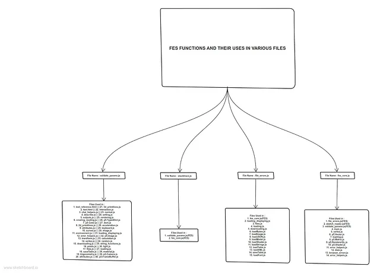

*Flowchart to understand the usages of FES functions*

Ayush Shankar is a 2022 graduate working as a Software Engineer in [GroundTruth](https://web.archive.org/web/20240812042327/https://www.groundtruth.com/) ([Weatherbug](https://web.archive.org/web/20240812042327/https://www.weatherbug.com/)). He has been an avid contributor to Open Source Software throughout the years, in various Open Source organizations. His technical skill set includes : JavaScript, ReactJs, NodeJs, MongoDb, Git/Github, and C#. He has interned at various startups during college and has also contributed to open source organizations like Gnome and [AnitaB.or](https://web.archive.org/web/20240812042327/https://anitab.org/)g. He has had an interesting open source journey which initially started from participating in various hackathons and also building personal projects. Programs like HacktoberFest motivated him to get started with open source software. He has also created a few personal projects that are open to all for contributions. Apart from open source, one of his major areas of interest are hackathons. He has participated in many of them and also has won a few of them. On the sidelines, he also writes blogs on [medium](/web/20240812042327/https://medium.com/@ayush23dash), where he has mentioned some amazing hackathon stories as well as his Google Summer of Code Story!

- [Work Product Report](https://web.archive.org/web/20240812042327/https://github.com/processing/p5.js/blob/main/contributor_docs/project_wrapups/ayush23dash_gsoc_2023.md)
- **Github Repository:** [p5.js](https://web.archive.org/web/20240812042327/https://github.com/processing/p5.js/tree/main)
- **Social media:** [LinkedIn](https://web.archive.org/web/20240812042327/https://www.linkedin.com/in/ayush23dash/)

## [Gaurav Puniya](https://web.archive.org/web/20240812042327/https://www.linkedin.com/in/gpuniya/) — Adding AR Image Markers and Migrating VR Library

Mentored by **[Aditya Rana](https://web.archive.org/web/20240812042327/https://www.instagram.com/adityarana814/)** and **Andrés Colubri**

**Current Status:** Finishing this project as part of an extended timeline which ends in November 2022.

AR and VR are an integral part of Processing Android. This project entailed migrating the VR library from Google VR (deprecated in 2019) to Cardboard SDK, and adding Image Marker functionality to PAndroid’s AR library.

As the coding period progressed, we discovered that the Cardboard SDK was built for Android NDK, i.e. all the methods for Cardboard SDK were written in C/C++. Thus, we needed to make Processing Android compatible with C++ and add a Java-Native-Interface (JNI) bridge. As this increased the said project’s complexity, we decided to extend our GSoC timeline to November.

The new path to migrate the VR-library would be:

- Import the Cardboard SDK.
- Create a JNI bridge.
- Change the existing VR templates.
- Add C++ support to the VR library.
- Map the new methods (from Cardboard-SDK) to their predecessors (from GVR).
- Migrate the methods to the new SDK.
- Test the new library with sample apps.

Due to the sudden spike in the project’s complexity and JNI being a new concept for Gaurav, they decided to add the AR Markers functionality first, while Gaurav explored more about JNI as a secondary task.

For the ARMarkers, [a new discussion](https://web.archive.org/web/20240812042327/https://github.com/processing/processing-android/discussions/743) was opened. Weekly progress reports can be found [here](/web/20240812042327/https://medium.com/@gauravpny/processing-android-weekly-reports-86f2abcfdd38).

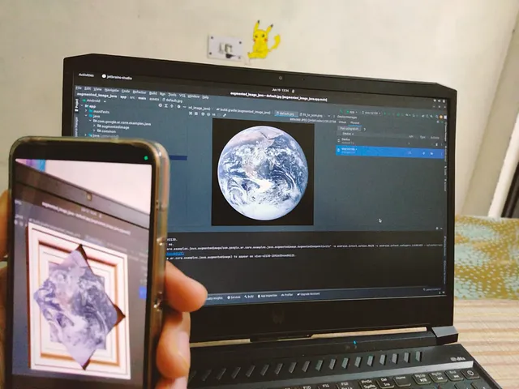

*An example of an Augmented Image*

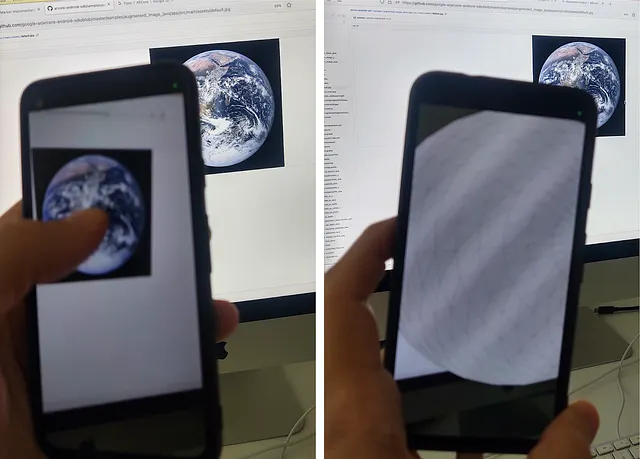

*An example of an augmented Image*

**Biography**

Gaurav Puniya is a final-year undergraduate student at NSUT, Delhi. He has prior experience as an android developer and is pursuing his research work in emotion-recognition through physiological signals. He is a tech enthusiast, exploring the intersection of technology and psyche. In his personal time, he resorts to e-sports and traveling.

**What I learned:**

- **Document Everything!**: There’s never enough documentation to make the world a better place for the next gen of programmers.
- **It’s okay to be overwhelmed**: With this being my first contribution to such a big organization and I felt overwhelmed with such a huge codebase. Though, I believe that this was a good experience just like your first error, first hello world program and first open-source contribution.
- **It’s all about collaboration**: Always remember that you are a part of a family when contributing to organizations. Which means, everyone is rooting for you and can actively guide you. All you need to do is raise an issue. ;-)

**Links:**

- [Work Product Report](https://web.archive.org/web/20240812042327/https://github.com/p4puniya/processing-gsoc/blob/main/project_wrapups/gaurav_puniya_gsoc_2023.md)
- **Github Repository:** [image-markers-and-migrating-vr](https://web.archive.org/web/20240812042327/https://github.com/p4puniya/image-markers-and-migrating-vr)
- [Additional Resources](/web/20240812042327/https://medium.com/@gauravpny)
- **Social media:**[Linkedin](https://web.archive.org/web/20240812042327/https://www.linkedin.com/in/gpuniya/)

## Dewansh Thakur — Mobile/Responsive Design Implementation of p5.js Web Editor.

Mentored by ***[Linda Paiste](https://web.archive.org/web/20240812042327/https://www.lindapaiste.com/)* and ***[Shuju Lin](https://web.archive.org/web/20240812042327/https://www.linkedin.com/in/linshujuuu/)

**Current Status:** Core functionalities completed, mobile editor completely works

This project is dedicated to the enhancement of mobile responsive design implementations for the web editor. The existing editor, prior to this project, is not so usable on smaller screen devices such as mobile phones and tablets. The primary objective of this project is to rectify these issues, ensuring that the editor functions seamlessly on mobile devices. This improvement will allow users to effortlessly view, share, and edit their project code while on the move.

During this project, Dewansh made significant progress in enhancing the mobile responsive design of the web editor. Here’s a summary of what they’ve achieved so far:

1. **Mobile-Friendly Editor:** They successfully made the web editor more usable on smaller screens such as mobile phones and tablets. The editor now adapts to different screen sizes, prioritizing components based on whether the sketch is running or not.

2. **Editor Component Refactoring:** They converted the editor from a class component to a functional component and improved the autosave logic for better performance and compatibility.

3. **SideBar Enhancement:** The SideBar component was refactored and made usable on mobile devices, aligning it with the design concepts.

4. **Floating Action Button:** They added a Floating Action Button for running and stopping sketches on smaller devices, improving user interaction.

5. **Mobile Navigation:** They introduced a new navigation component that dynamically displays page titles, adapts menu options, enables sketch name editing, and offers a custom language selection screen for better usability on mobile devices.

6. **My Stuff Page:** They redesigned the "My Stuff" page to improve its usability on mobile devices, switching from a tabular list to a card-based layout, and adding filter and sort functionality.

7. **Login, SignUp, and Account Pages:** They made small adjustments to these pages to ensure they look and function well on smaller screens.

8. **Overlays and Modals:** Overlays and modals were improved for mobile devices, providing a native mobile look and feel by expanding to the entire screen.

9. **Codebase Refinements:** They centralized essential logic for editing and saving operations into a dedicated hook, enhancing code reusability.

Looking ahead, here are some future plans and areas for improvement:

1. **Code Sharing Page:** Implement a code sharing page for users to share their projects easily.

2. **Add to Collection Page:** Develop a page where users can add sketches to their collections.

3. **MobileNav Title:** Consider using props for mobile navigation titles instead of a switch for better flexibility.

4. **Language Translations:** Add language translations to some of the newer components for a more inclusive experience.

5. **Autosave Feature:** Move the autosave feature to the Editor component for better organization.

This project has been a valuable learning experience, providing insights into open-source contribution, teamwork, and effective communication. Dewansh is grateful for the mentorship provided by Linda and Shuju, and he is excited to continue contributing to open-source projects in the future.

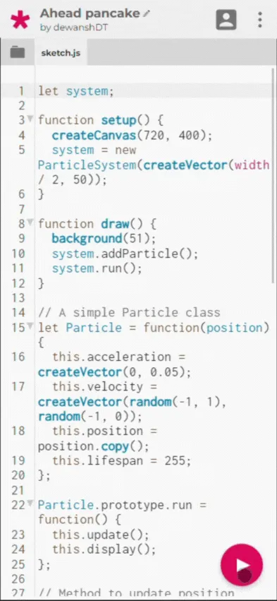

*Editor and the preview*

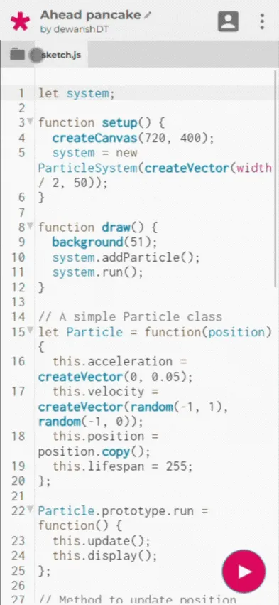

*File drawer*

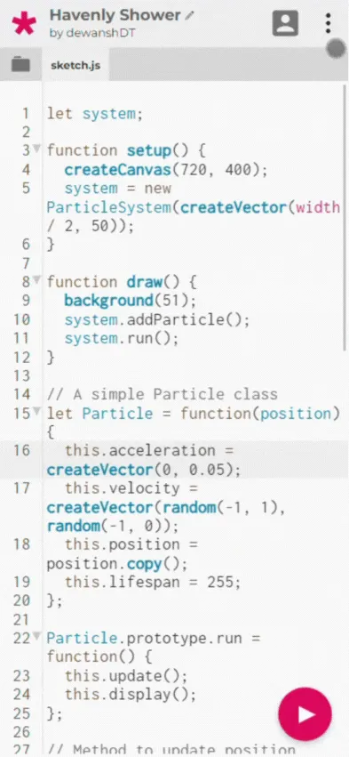

*Language menu*

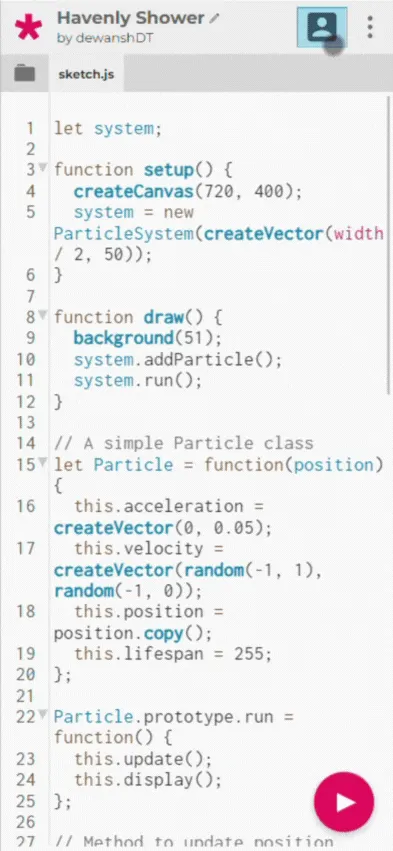

*My stuff page*

Dewansh Thakur is a creative web developer and designer. He is currently a third-year undergraduate student at Bhilai Institute of Technology Durg, pursuing Information Technology as his major. Dewansh Thakur’s an active contributor to open source technologies and is also interested in all kinds of stuff related to tech and art.

- [Work Product Report](https://web.archive.org/web/20240812042327/https://blog.dewansh.space/blog/google-summer-of-code-wrap-up)
- [Github Repository](https://web.archive.org/web/20240812042327/https://github.com/processing/p5.js-web-editor)
- **Social media:**
[Twitter](https://web.archive.org/web/20240812042327/https://twitter.com/ThakurDewansh), [LinkedIn](https://web.archive.org/web/20240812042327/https://www.linkedin.com/in/dewanshthakur/), [Github](https://web.archive.org/web/20240812042327/https://github.com/dewanshDT), [Website](https://web.archive.org/web/20240812042327/https://dewansh.space/)

## [Aryan Koundal](https://web.archive.org/web/20240812042327/https://www.linkedin.com/in/aryankoundal/)— Improving p5.js WebGL/3D functionality

Mentored by **[Dave Pagurek](https://web.archive.org/web/20240812042327/https://twitter.com/davepvm)** and **[Tanvi Kumar](https://web.archive.org/web/20240812042327/https://www.linkedin.com/in/TanviKumar/)**

**Current Status:** On-going (Large Project)

In p5.js, there are two render modes: P2D (default renderer) and WebGL. WebGL enables the user to draw in 3D. There are many ways to implement lighting. Currently, p5.js has implemented 8. To add lighting to a 3D object, one can use these functionalities. However, there is another technique to light objects, not by direct light, but using the surrounding environment as a single light source, which we call Image-Based Lighting.

This project aims to add lighting to a 3D object, using the surrounding environment as a single light source, which is generally called Image-Based Lighting. In simple words, one can very quickly drop in an image from real life to use as surrounding lights, rather than continuously tweaking the colors and positions of ambient, point, etc. lights.

Tasks in the project are listed below.

- Diffused IBL
- CubeMap Convolution
- PBR and Irradiance Lighting
- Specular IBL
- Pre-filtering environment map
- Pre-computing the BRDF

There is no plan to make any extensions. Aryan and his mentors feel that the work will be completed according to schedule.

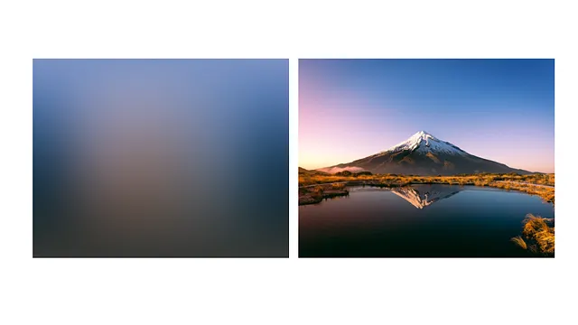

*A diptych showing before (on right hand side) and after (on left hand side) images.*

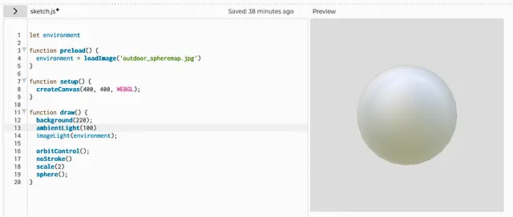

*Screenshot of the sketch made using the build for a sub-feature of the Image-Based Lighting Project.*

Aryan Koundal is currently a final-year student at NIT Hamirpur, where he is pursuing a bachelor’s degree in technology in Computer Science and Engineering. He is proficient in Data Structures and Algorithms in C++. He is currently working as a remote developer for the p5.js library through Google Summer of Code 2023. He belongs to Dharamshala Himachal Pradesh, a city known for being home to the world’s highest cricket stadium.

- [Work Product Report](https://web.archive.org/web/20240812042327/https://github.com/processing/p5.js/pull/6442)
- **Github Repository:** [https://github.com/AryanKoundal/p5.js](https://web.archive.org/web/20240812042327/https://github.com/AryanKoundal/p5.js)
- **Social media:** [LinkedIn](https://web.archive.org/web/20240812042327/https://www.linkedin.com/in/aryan-koundal-5b217b202/)

## [Munus Shih](https://web.archive.org/web/20240812042327/https://www.instagram.com/munusshih/)— A Typographic Revamp for p5.js

Mentored by **[Kevin Yeh](https://web.archive.org/web/20240812042327/https://twitter.com/spacetypeco)**, **[Aren Davey](https://web.archive.org/web/20240812042327/https://twitter.com/albeit_angular)**, and **[Kenneth Lim](https://web.archive.org/web/20240812042327/https://www.linkedin.com/in/will-rabalais-28b005216/)**

**Current Status:** Completed (But needs more work!)

This project aims to improve the typographic section of p5.js library by fixing the issue flag on GitHub, adding new features, developing new examples for typography documentation, and interviewing creative coders for feedback. The goal is to enhance the functionality and versatility of p5.js, and ensure that it remains a valuable tool for creative coders and graphic designers.

During his time in the Google Summer of Code (GSoC) program, Munus had the opportunity to work on typography-related tasks in p5.js. While his contributions may not have resulted in numerous pull requests within the program’s limited timeframe, he gained valuable insights into the intricacies of this specialized section within p5.js. Typography is a field that intersects with various technical challenges, including its reliance on opentype.js, integration with the HTML Canvas API, support for WebGL, internationalization concerns, and domain-specific knowledge.

*Some experiments with font visualization.*

*An intensive examination of text combinations to enhance the functionality of the textToPoint function.*

Munus Shih (he/him) is a Taiwanese Hakka designer, coder, organizer based in NYC, passionate about bringing more critical and diverse perspectives to teaching code. With a background in design and technology, Munus leverages contextual data and customized algorithms to explore community organizing.

Thank you to our cohort of GSoC Contributors, mentors, and advisors for another amazing summer of code. We hope to keep supporting the creative code and open source community, year after year. Want to support the Processing Foundation in this work? [Donate here](https://web.archive.org/web/20240812042327/https://processingfoundation.org/donate) to support our ecosystem of open source contributions!

---

*Originally published on [Medium](https://medium.com/@ProcessingOrg/google-summer-of-code-2023-wrap-ups-961f73edcd1b). Archived 2026-03-09.*
