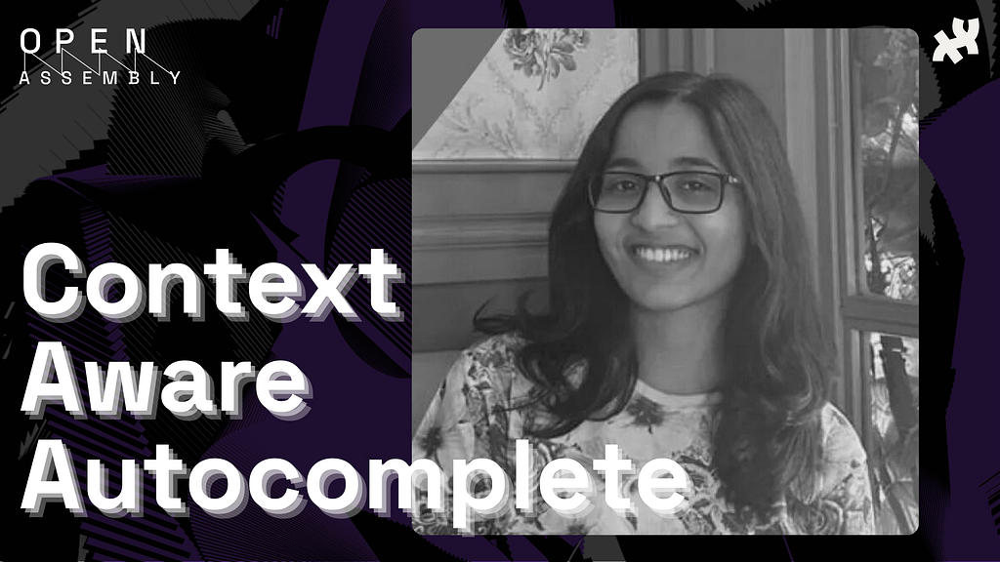
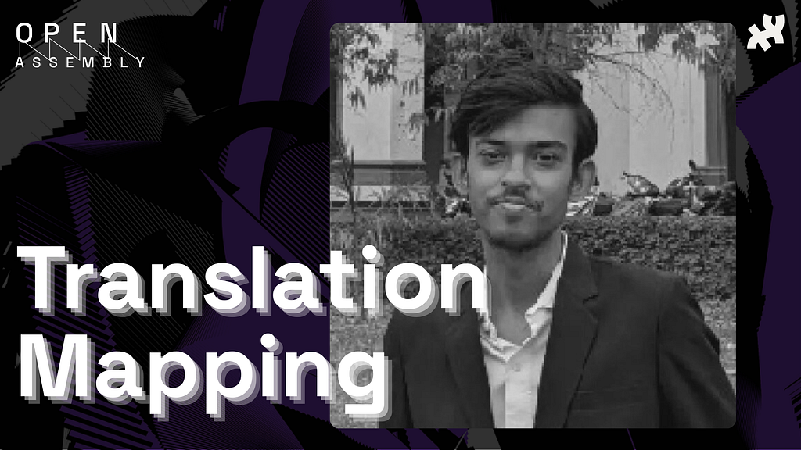
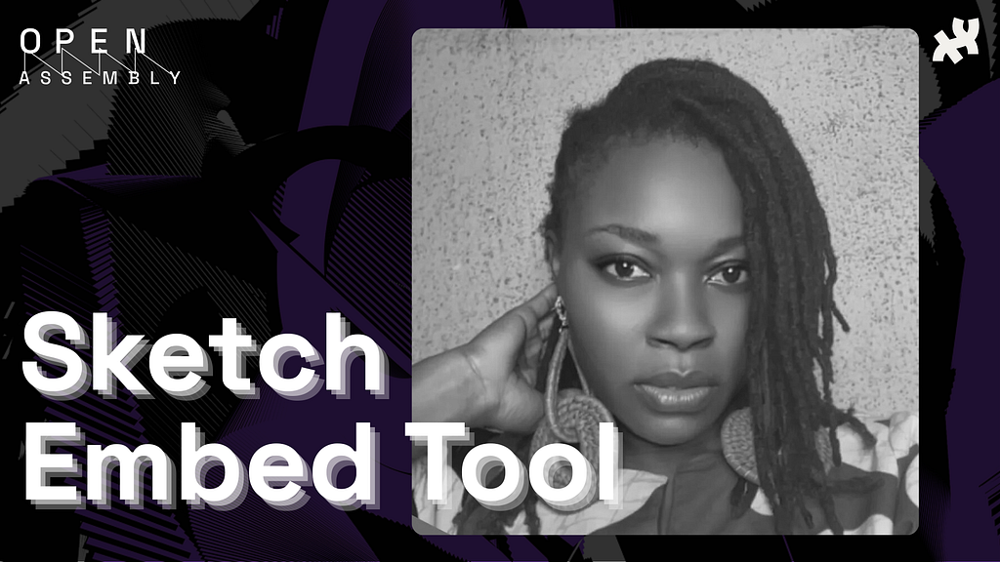
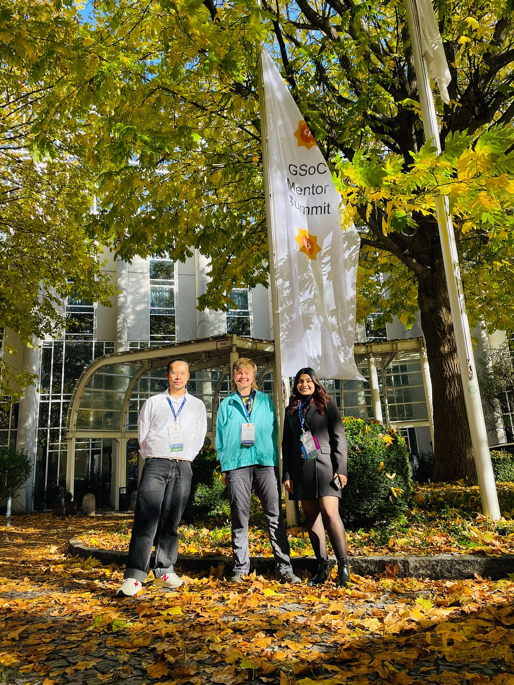

### Google Summer of Code 2025 — Wrap-Up and Mentor Summit

In 2025, the Processing Foundation celebrated its thirteenth year of participation in Google Summer of Code (GSoC)! The primary goal of the GSoC program is to welcome new contributors to open-source software development. Out of a pool of about 150 submissions, 3 outstanding projects were [selected](https://medium.com/@ProcessingOrg/announcing-google-summer-of-code-2025-projects-6463d0e49470) to improve [p5.js](https://p5js.org/) coding experience. Each project was supported by mentors, and culminated in merged code and a public presentation at the [Open Assembly](https://openassembly.processingfoundation.org/) in 2025.

**Project 1: [Context-Aware Autocomplete and Navigation for the p5.js Editor](https://youtu.be/TVIZhfxpnLg?si=nFr-nKhgC-LO7sXl)**

- Contributor: [Kamakshi Bali](https://kamakshi645.medium.com/gsoc25-processing-foundation-final-work-c2069c536ae8)
- Mentors: [Diya Solanki](https://github.com/diyaayay) and [Tristan Espinoza](https://github.com/tespin)

**Project 2: [Translation Mapping and Accessibility for p5.js](https://youtu.be/kUXVl8kwwZs?si=jVl7ceTPnAbvZW-E)**

- Contributor: [Divyansh Srivastava](https://www.linkedin.com/in/divyansh013/)
- Mentors: [Kit Kuksenok](https://xnze.ro/)

**Project 3: [p5.js Sketch Embed Tool for Blogs and Websites](https://youtu.be/7HwWTwmJBcY?si=PVyNOSDycaPx9CPY)**

- Contributor: [Ego Nwaekpe](https://www.linkedin.com/in/glory-nwaekpe/)
- Mentors: [Dora Do](https://www.doradocodes.com/)

During GSoC, contributors work on projects in mentor orgs, learning how to be a part of the open source software community. In 2025, Processing Foundation was one of [185 accepted organizations](https://opensource.googleblog.com/2025/08/google-summer-of-code-2025-contributor-statistics.html). Each contributor is supported by one or two mentors, but is responsible for completing their own project. The contributors worked over the summer, and shared their work in the [Open Assembly](https://openassembly.processingfoundation.org/) alongside other 2025 Processing Foundation grantees and fellows.

Once the GSoC program was complete in the fall, the mentors from the participating organizations came together in Munich for the GSoC Mentor summit. This inspiring and energizing unconference connected us with open source mentors and maintainers over conversations on how to make open source software communities more sustainable, inclusive, and welcoming.

*Tristan Espinoza, Kit Kuksenok, and Diya Solanki (from left to right) at the GSoC Mentors Summit*

This year, three mentors from Processing Foundation were able to attend: [Diya Solanki](https://github.com/diyaayay), [Tristan Espinoza](https://github.com/tespin), and [Kit Kuksenok](https://xnze.ro/).

Processing Foundation mentor delegates, Diya, Tristan, and Kit participated in unconference sessions and discussions that reflected on improving GSoC application and contributor engagement, on funding and governance in open source, on diversity and open source community health and sustainability, on open source in academia and in computational biology, and tooling for supply chain security.

The conversations at the mentor summit translated practical input into ongoing project work and into ideas about projects in internationalization, simulation, and academic collaborations, as well as reflections for future programs. For example, [this pull request](https://github.com/processing/p5.js/pull/8194) introduces clear guidelines on how LLM-based tools should interact with this repository and its contributors. With the goal of removing barriers to contribution, we will improve the application processes with a clear template, focusing on custom projects grounded in experience with the Processing and p5.js ecosystem.

Thank you to our cohort of GSoC Contributors, mentors, and advisors for another amazing summer of code. We hope to keep supporting the creative code and open source community, year after year.

Want to support the Processing Foundation in this work? [Donate here](https://processingfoundation.org/donate) to support our ecosystem of open source contributions!

---

*Originally published on [Medium](https://medium.com/@ProcessingOrg/google-summer-of-code-2025-wrap-up-and-mentor-summit-d1e565e9fe1f). Archived 2026-03-09.*
